# Protocol Reference

This document describes the I2P wire formats implemented by i2per 0.1.0.
Unsupported formats and release limitations are listed explicitly.

All multi-byte integers in I2P are big-endian unless otherwise noted. Ed25519
signatures use the little-endian encoding for signature type 7.

The Java reference implementation (i2p-java) is the encoding reference and
i2pd (C++) is the behavioral reference. The I2P specifications are available
in the [I2P documentation](https://i2p.net/en/docs/).

## Release boundaries

The 0.1.0 release does not implement NTCP1, SSU1, I2CP, the legacy
ElGamal/AES garlic formats, Datagram2, or a TUN interface. SSU2 path migration,
RTT-based congestion control, automatic Charlie selection for PeerTest, and
the complete firewalled HolePunch path are also outside this release. The
sections below describe only behavior that is present in 0.1.0.

## Implemented

### NTCP2 data-phase frames

After the Noise handshake completes, each data message is an authenticated
ChaChaPoly "frame" preceded by a 2-byte big-endian length that is obfuscated
with SipHash-2-4 so that frame boundaries cannot be correlated. There is no
additional frame header in the data phase.

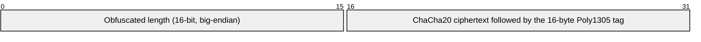

| Field | Size | Description |
|-------|------|-------------|
| Obfuscated length | 2 bytes | Frame length (ciphertext + 16-byte MAC) XOR the low 16 bits of SipHash-2-4 |
| Encrypted data | 0-65519 bytes | ChaCha20 ciphertext, same size as the plaintext |
| MAC | 16 bytes | Poly1305 authentication tag |

A full frame including the length field is 18-65537 bytes; the decrypted
length must be 16-65535.

**Length obfuscation.** Per direction the connection has a 16-byte SipHash-2-4
key and an 8-byte IV (from the data-phase KDF). For each frame:

```
IV[n] = SipHash-2-4(key, IV[n-1])
mask   = low 2 bytes of IV[n]
obfuscated = length XOR mask
```

`obfuscate_length/2` and `deobfuscate_length/2` in `m:i2p_framing` implement
this. The primitive is KAT-validated in `m:i2p_siphash`.

**Encryption.** Each frame is sealed with ChaCha20-Poly1305 under the
direction key `k_ab` (Alice→Bob) or `k_ba` (Bob→Alice) with no associated
data and a counter nonce: 4 zero bytes + 8-byte little-endian message number
(`i2p_crypto:es_nonce/1`), starting at 0.

**Frame contents.** The plaintext is zero or more blocks, each a 1-byte type
and a 2-byte big-endian length:

| Type | Meaning |
|------|---------|
| 0 | DateTime |
| 1 | Options |
| 2 | RouterInfo |
| 3 | I2NP message |
| 4 | Termination |
| 254 | Padding (must be the last block; at most one) |

Padding, if present, is always the last block. Unknown block types must be
ignored. `encode_block/2`, `pad_block/1` and `decode_blocks/1` in
`m:i2p_framing` implement the block format.

**Keepalive and idle reaping.** Once the data phase starts, the connection sends a
DateTime block (type `0`, four Unix seconds) every
`ntcp2_keepalive_interval_ms` (`i2per` env, default 60 s). It also arms an
`idle_timeout_ms` timer (`i2per` env, default 120 s). In the current data loop,
the timer is refreshed by inbound frames *and* by outbound application or
keepalive sends, so it measures process activity rather than strictly peer
replies. A peer that stops answering can therefore remain connected while local
keepalives continue; the timer fires only when both directions are quiet, and
the process exits `{idle_timeout, no_activity}`. The DateTime block is a
transport keepalive, not an I2NP application message.

**Data-phase keys.** `data_phase_keys/2` derives `k_ab`, `k_ba` and the two
SipHash key/IV pairs from the handshake chaining key and hash, per the Noise
`split()` extended with the SipHash "ask" KDF:

```
temp_key    = HMAC-SHA256(ck, ZEROLEN)
k_ab        = HMAC-SHA256(temp_key, 0x01)
k_ba        = HMAC-SHA256(temp_key, k_ab || 0x02)
ask_master  = HMAC-SHA256(temp_key, "ask" || 0x01)
temp_key    = HMAC-SHA256(ask_master, h || "siphash")
sip_master  = HMAC-SHA256(temp_key, 0x01)
temp_key    = HMAC-SHA256(sip_master, ZEROLEN)
sipkeys_ab  = HMAC-SHA256(temp_key, 0x01)             # key = b0..15, IV = b16..23
sipkeys_ba  = HMAC-SHA256(temp_key, sipkeys_ab || 0x02)
```

### RouterInfo, RouterAddress and Mapping

A RouterInfo is the signed, self-describing record a router publishes to the
NetDb. It is needed by NTCP2 both as the m3p2 payload block and as the
source of a published connector (`host`/`port`/`i`/`s`) when establishing an
outbound connection. A firewalled router may instead publish a non-published
NTCP2 address that is valid for NetDb and SSU2 purposes but is not directly
dialable. Implemented in `m:i2p_router_info`.

#### Mapping wire format

A Mapping is a size-prefixed list of `String key = String value ;` pairs.
Keys are encoded in sorted order. The 2-byte size counts the pair bytes only,
not the size field itself.

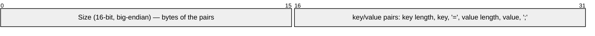

| Field | Size | Description |
|-------|------|-------------|
| Size | 2 bytes | Byte count of all pairs (keys, `=`, values, `;`) |
| Per pair | 1 + N + 1 + 1 + M + 1 | `key_len` ‖ key ‖ `=` ‖ `value_len` ‖ value ‖ `;` |

An empty Mapping is just `<<0:16>>`. `parse_mapping/1` and `encode_mapping/1`
in `m:i2p_router_info` implement this (encode sorts keys).

#### RouterAddress wire format

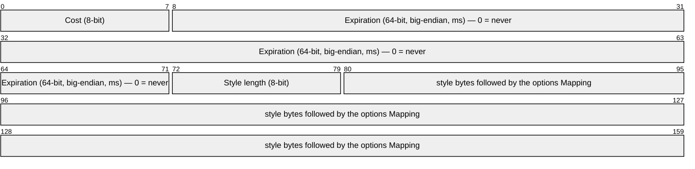

| Field | Size | Description |
|-------|------|-------------|
| Cost | 1 byte | NTCP2 published = 3; non-published = 14 |
| Expiration | 8 bytes | Big-endian ms; 0 means no expiry |
| Style length | 1 byte | Length of the transport style string |
| Style | N bytes | Transport name, e.g. `NTCP2`, `SSU2`, `HTTP` |
| Options | Mapping | Transport-specific key/value options |

For a published NTCP2 address the options are:

| Option | Value |
|--------|-------|
| `host` | IP address string |
| `port` | TCP port |
| `i` | 16-byte IV, I2P Base64 (24 chars) |
| `s` | 32-byte X25519 static public key, I2P Base64 (44 chars) |
| `v` | `2` |
| `caps` | Address capability flag: `4` (IPv4) or `6` (IPv6), derived from the host |

A firewalled client uses a non-published NTCP2 address instead. Its wire
record has cost `14`, expiration `0`, style `NTCP2`, and only these options:

| Option | Value |
|--------|-------|
| `s` | 32-byte X25519 static public key, I2P Base64 (44 chars) |
| `v` | `2` |
| `caps` | Address family: `4` (IPv4) or `6` (IPv6) |

There is deliberately no `host`, `port`, or `i` option in this form. The
address is accepted into the NetDb and can be used by SSU2/introducer
machinery, but `ntcp2_connector/1` returns `no_reachable_ntcp2`; an outbound
NTCP2 dial must never be attempted from it. The router-level `caps` value is
`U` (unreachable) for this posture. `ntcp2_nonpublished_address/2` builds the
form, while `ntcp2_address/4` builds the published form. Both constructors
feed the same `parse_address/1` / `encode_address/1` wire path.

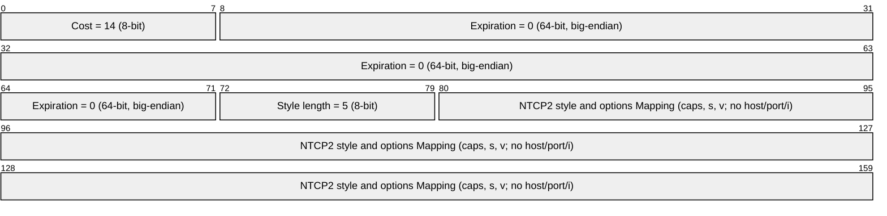

The X25519 static key is the peer's NTCP2 "static key" used as the Noise XK
pre-message (`s` in the handshake). `ntcp2_connector/1` extracts the
`{host, port, static, iv}` tuple consumed by `i2p_ntcp2:alice_init/5` only from
a published address.

#### RouterInfo wire format


| Field | Size | Description |
|-------|------|-------------|
| Identity | 391 bytes | Standard RouterIdentity (see KeysAndCert) |
| Published | 8 bytes | Big-endian ms since epoch |
| Number of addresses | 1 byte | Count of RouterAddress entries |
| Addresses | variable | Concatenated RouterAddress records |
| psiz | 1 byte | Number of peer RouterInfos; always 0 |
| Options | Mapping | Router-wide options |
| Signature | 64 bytes | Ed25519 over every byte before it, with the identity's signing key |

Standard router options include `netId=2` (I2P network id) and
`router.version` (software version, e.g. `0.9.74`). i2pd's `WriteToStream`
writes published addresses with options in the order `host;port;i;s;v` and
`caps`; `m:i2p_router_info` sorts option keys, which is wire-compatible since
parsers read the Mapping generically.

**Router-level `caps`.** A router-wide `caps` value describes the router's
capabilities and advertises its transit participation. The current validator
requires a non-empty string containing exactly one bandwidth-class letter
(`K`/`L`/`M`/`N`/`O`/`P`/`X`); it permits the letters in any order, allows at
most one reachability flag (`R` reachable or `U` unreachable), and allows at
most one `f` floodfill marker. It rejects unknown letters, a second bandwidth
class, a second reachability flag, a second `f`, and the reject-tunnels `G`
flag. A reachability flag is optional (`L` and `fL` are valid). This is the
behavior of `m:i2p_router_info:validate_caps/1`; `caps_string/3` emits the
usual canonical `<R|U><bandwidth>[f]` form.

The local router composes its `caps` in `m:i2p_identity:build_local/4`:

- **Bandwidth class** — app env `caps_bandwidth` (default `L`), set via the
  `caps.bandwidth` key in `i2per.conf`.
- **Reachability** — `R` only when NTCP2 is published and the operator did not
  opt into `allow_private_host`; `U` for a non-published or explicitly private
  local boot.
- **Floodfill** — `f` appended when `m:i2p_floodfill:is_floodfill/0` is true.

Example values: `RL` (reachable/non-floodfill), `RLf` (reachable floodfill),
`UL` (firewalled/non-published non-floodfill).

**Validation** (mirrors i2pd `ReadFromBuffer`): the structure must parse, the
timestamp must be non-zero, `netId` must equal 2, `router.version` must be
present, at least one NTCP2 address with a valid `s` static key must exist, and
the Ed25519 signature must verify over the exact original body bytes. A
non-published NTCP2 address is valid for storage even though it has no direct
connector; `ntcp2_connector/1` applies the stricter published-address check.
Failures return `{error, Reason}` with `too_short`, `malformed`,
`{bad_identity, _}`, `{bad_timestamp, 0}`, `bad_signature`, `net_id_mismatch`,
`missing_router_version`, `no_reachable_ntcp2`, `{bad_static_key, _}` or
`{bad_iv, _}`.

**In the data phase.** As a frame block (type 2, see the NTCP2 data-phase
section above), a RouterInfo is wrapped as
`<<2:8, Size:16/big, 0:8, RouterInfo/binary>>` where
`Size = byte_size(RouterInfo) + 1` (the flag byte 0) — i.e.
`i2p_framing:encode_block(2, <<0:8, RI/binary>>)`. `m3p2_block/1` produces
this from a RouterInfo binary.

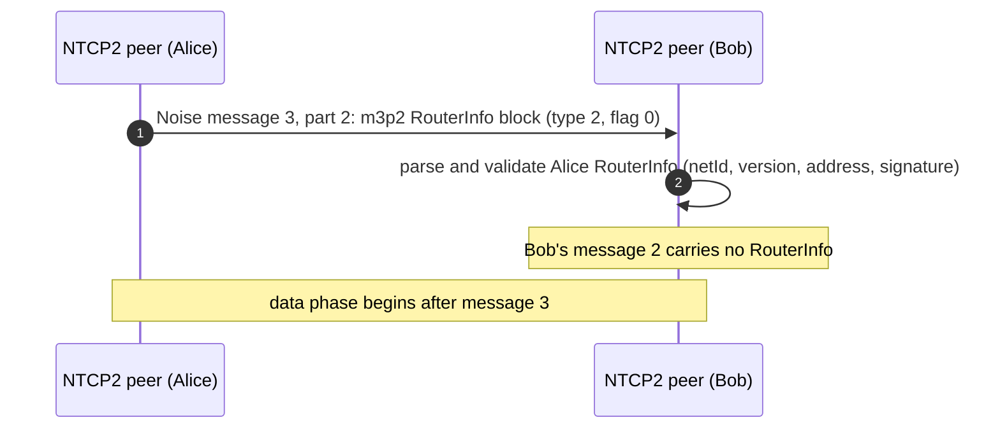

### SipHash-2-4

SipHash-2-4 is the hash NTCP2 uses for the frame-length obfuscation above.
The pure-Erlang `m:i2p_siphash` implements the 64-bit and 128-bit variants,
validated against the official veorq/SipHash reference (every tail length
0..7, the 8-byte block boundary, and multiple blocks) and against OpenSSL's
`SIPHASH`. The implementation is `m:i2p_siphash`.

### I2NP messages

I2NP (I2P Network Protocol) is the router-to-router protocol layer above the
transports. Implemented in `m:i2p_i2np`.

#### I2NP short message header

Over NTCP2 each I2NP message travels inside a data-phase block of type 3
(see the NTCP2 data-phase section above). The block's 2-byte size covers a
**short header** plus the message body; there is no separate length field or
checksum — the body length is the block size minus 9:

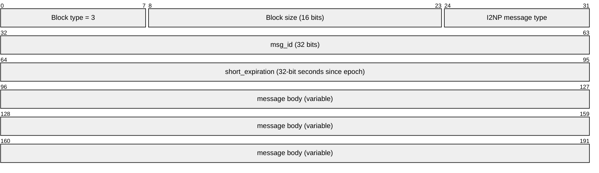

| Field | Size | Description |
|-------|------|-------------|
| type | 1 byte | I2NP message type (table below) |
| msg_id | 4 bytes | Big-endian message ID, random per message |
| short_expiration | 4 bytes | Big-endian Unix time, seconds; the body is `block size − 9` |
| body | variable | Message-specific payload |

The short header (9 bytes) drops the 7 trailing bytes of the standard 16-byte
header: the 8-byte millisecond expiration becomes 4-byte seconds, and the
size + checksum bytes are provided by the enclosing block and AEAD frame.

#### I2NP standard 16-byte header

When I2NP messages are wrapped inside tunnels (but not garlic cloves), they use
the full 16-byte header with explicit size and checksum fields:

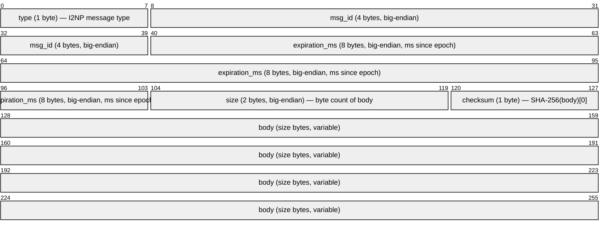

| Field | Size | Description |
|-------|------|-------------|
| type | 1 byte | I2NP message type (same codes as the short header) |
| msg_id | 4 bytes | Big-endian message ID, random per message |
| expiration_ms | 8 bytes | Big-endian Unix time in milliseconds |
| size | 2 bytes | Byte count of the body that follows |
| checksum | 1 byte | First byte of SHA-256(body); 0 is tolerated on decode (i2pd re-wraps short-header messages with checksum 0) |
| body | variable | Message-specific payload |

Encode produces a real SHA-256[0] checksum. Decode tolerates any checksum
value — this matches i2pd's `FromNTCP2()` conversion which emits checksum 0
when re-wrapping short-header messages into standard-header form. Implemented
in `m:i2p_i2np:encode_std/1` and `m:i2p_i2np:decode_std/1`.

**Message types** (wire byte):

| Type | Message |
|------|---------|
| 1 | DatabaseStore |
| 2 | DatabaseLookup |
| 3 | DatabaseSearchReply |
| 10 | DeliveryStatus |
| 11 | Garlic (**implemented**) |
| 18 | TunnelData (**implemented**) |
| 19 | TunnelGateway (**implemented**) |
| 20 | Data |
| 25 | ShortTunnelBuild (**implemented**) |
| 26 | OTBRM (**implemented**) |
| 0, 224–254, 255 | Reserved |

#### DatabaseStore (type 1)

An unsolicited store, or the reply to a successful DatabaseLookup. The
one-byte store type is part of the DatabaseStore body, not part of a
LeaseSet's own content. The values used by the I2NP codec are `0` (RouterInfo),
`1` (LeaseSet), `3` (LeaseSet2), `5` (EncryptedLeaseSet), and `7`
(MetaLeaseSet). i2per's NetDb path stores types `0`, `1`, and `3`. Types `5`
and `7` **are decoded** — the codec reports every byte on the wire rather than
only the types it understands — and are then dropped as unimplemented, with a
warning naming the type. The distinction matters: a type i2per cannot parse and
a type it has no parser for are different facts, and only the latter arrives
here. Encrypted LeaseSet is live in both reference routers (off by default);
MetaLeaseSet remains draft.

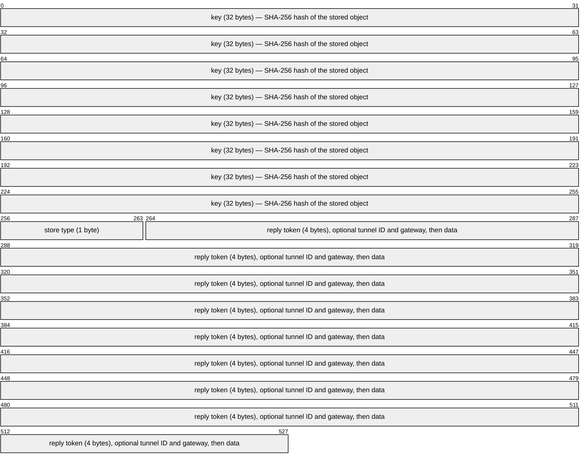

| Field | Size | Description |
|-------|------|-------------|
| key | 32 bytes | The "real" hash of the RouterIdentity (or Destination) |
| store type | 1 byte | `0` RouterInfo; `1` LeaseSet; `3` LeaseSet2; `5` EncryptedLeaseSet; `7` MetaLeaseSet |
| reply token | 4 bytes | 0 = no reply; nonzero = request a DeliveryStatus with this message ID and (for floodfills) re-flood |
| reply tunnel ID | 4 bytes | Present only when token > 0; 0 = direct to the gateway, otherwise the inbound tunnel |
| reply gateway | 32 bytes | Present only when token > 0; hash of the reply router/gateway |
| data | variable | Type 0: `size(2) ‖ gzip(RouterInfo)`; types 1, 3, 5, and 7: raw LeaseSet-family bytes |

For `store type 0`, the data is a 2-byte big-endian size followed by a
gzip-compressed RouterInfo. The gzip header must be `1F 8B 08 00 00 00 00 00
02 FF` — modification time 0, XFL 2, OS 0xFF — so routers do not leak their
build time or OS. `m:i2p_i2np:gzip_router_info/1` emits exactly this;
`m:i2p_i2np:gunzip_router_info/1` also accepts i2pd's stored-block
(uncompressed deflate) variant used for small RouterInfos.

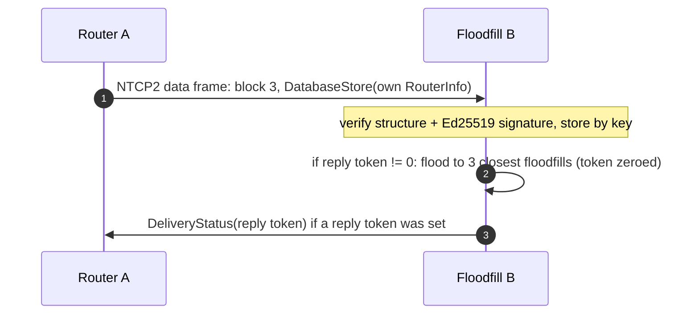

#### DatabaseLookup (type 2)

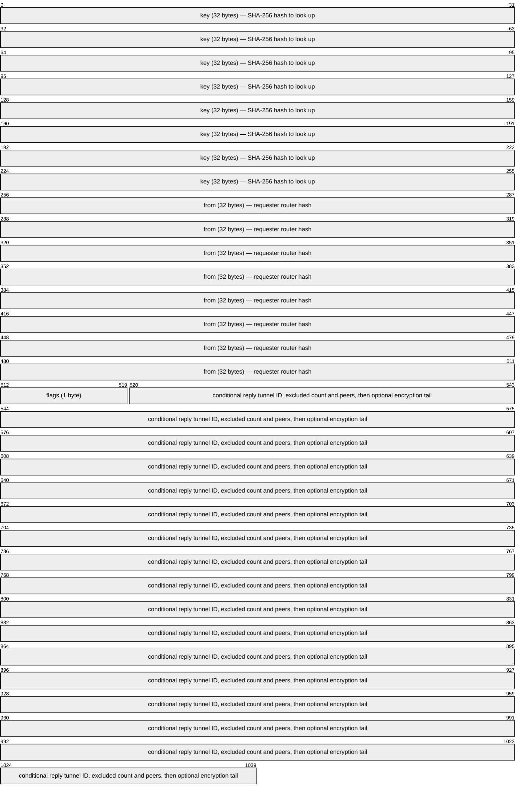

| Field | Size | Description |
|-------|------|-------------|
| key | 32 bytes | Hash of the object to look up (random for exploration) |
| from | 32 bytes | Requesting router's hash; with tunnel delivery it is paired with the reply tunnel ID as the gateway |
| flags | 1 byte | bit 0 delivery (1 = reply via tunnel), bit 1 encryption, bits 3-2 lookup type, bit 4 ECIES |
| reply tunnel ID | 4 bytes | Present only when bit 0 is set; the requester's inbound receive ID |
| excluded count | 2 bytes | Number of excluded peers, 0–512; follows the optional tunnel ID |
| excluded peers | count × 32 bytes | Hashes to exclude from any DatabaseSearchReply |
| reply encryption tail | variable | Present after the excluded list when bit 1 is set; the decoder preserves these reply-key/tag bytes without interpreting them |

In the direct form the body is `key ‖ from ‖ flags ‖ excluded_count ‖
excluded_hashes`. In the tunnel form it is `key ‖ from ‖ flags ‖
reply_tunnel_id ‖ excluded_count ‖ excluded_hashes`; the tunnel ID is
present only when bit 0 is set. An encrypted lookup may append reply-key and
reply-tag bytes after the excluded hashes; the current decoder preserves that
tail without parsing it.

**Lookup type bits 3-2:** `00` ANY (deprecated), `01` LeaseSet, `10`
RouterInfo, `11` exploration (the reply lists non-floodfill routers close to
the key). The peer manager sends RouterInfo and exploratory lookups with the
delivery flag clear and no encryption.

#### DatabaseSearchReply (type 3)

The reply to a failed lookup: the hashes the responder considers closest to
the requested key.

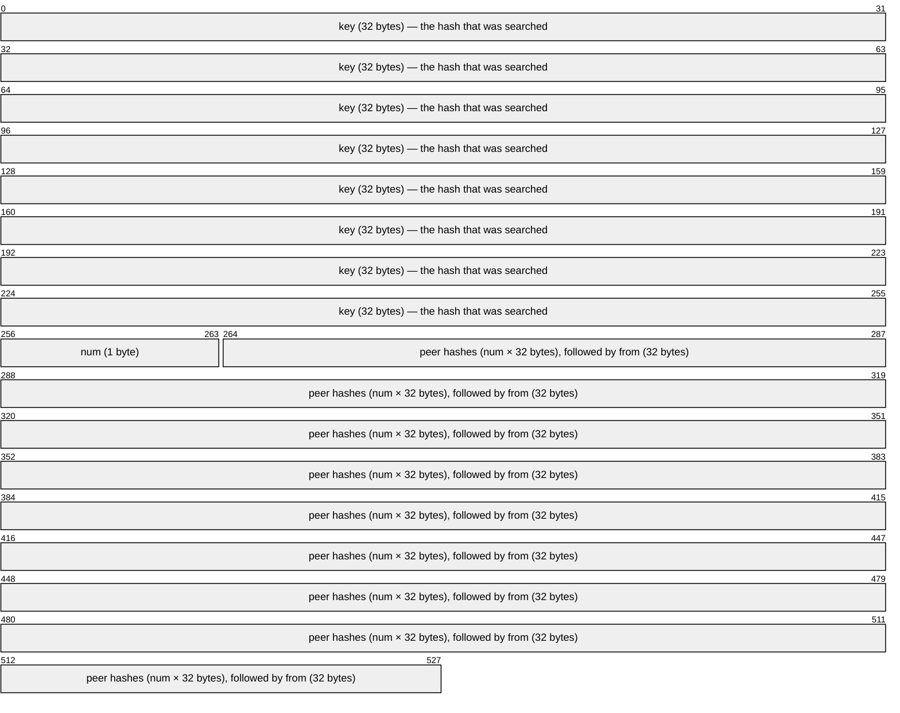

| Field | Size | Description |
|-------|------|-------------|
| key | 32 bytes | SHA-256 of the object being searched |
| num | 1 byte | Number of peer hashes (typical 3, recommended max 16) |
| peer hashes | num × 32 | Hashes the responder thinks are close to the key |
| from | 32 bytes | Responder's hash — unauthenticated, treat as advisory |

#### DeliveryStatus (type 10)

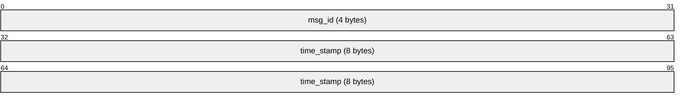

| Field | Size | Description |
|-------|------|-------------|
| msg_id | 4 bytes | The message ID being acknowledged |
| time_stamp | 8 bytes | Big-endian ms since epoch |

### Identity and ECIES

The identity layer implements the standard `KeysAndCert` structure shared by
RouterIdentity and Destination (identical on the wire), plus the ECIES-X25519
and Ed25519 crypto primitives.

#### KeysAndCert wire format

A standard identity is a 384-byte region of keys and padding followed by a
Certificate (Proposal 161 padding compression):

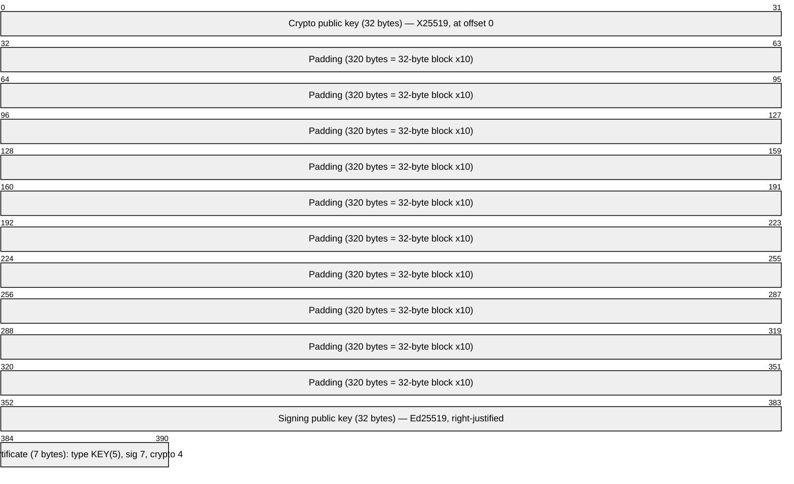

| Field | Size | Description |
|-------|------|-------------|
| Crypto public key | 32 bytes | X25519 encryption public key (crypto type 4), at offset 0 |
| Padding | 320 bytes | One random 32-byte block repeated 10 times (320 bytes; compressible per Proposal 161) |
| Signing public key | 32 bytes | Ed25519 signing public key (sig type 7), right-justified with 32 + 320 + 32 = 384 |
| Certificate | 7 bytes | `type=5 (KEY)` + 16-bit length=4 + `sig_type=7` + `crypt_type=4` |

Total identity: 391 bytes; identity hash = SHA-256 of all 391 bytes (32 bytes).
Identities with other key types are recognized but rejected (NULL cert implies
the legacy ElGamal + DSA pair; only X25519 + Ed25519 is supported). Implemented
in `m:i2p_keys`.

#### Base64 / Base32

- **Base64 (I2P alphabet):** the identity bytes encoded with
  `A-Za-z0-9-~` and `=` padding — a 391-byte identity encodes to 524
  characters, as used in RouterInfo and `hosts.txt`.
- **Base32:** lower-case, padding-free Base32 (RFC 4648) of the identity hash
  (32 bytes) plus the `.b32.i2p` suffix — a Destination address is 52 chars +
  suffix = 60 bytes.

Both encodings are validated against the i2p-java and i2pd reference
encodings. The implementation is `m:i2p_keys`.

#### Crypto primitives

- Ed25519 signatures (sig type 7, little-endian, RFC 8032): keygen/sign/verify.
- X25519 Diffie-Hellman (crypto type 4, RFC 7748).
- Elligator2 encoding/decoding of X25519 ephemeral keys (reference
  `Elligator2.java` vectors).
- HKDF-SHA256 (RFC 5869), the Noise `MixHash`/`MixKey` primitives, and the
  pure key-derivation steps of the ECIES ratchets (`dh_initialize` and friends).
- ChaCha20-Poly1305 AEAD (RFC 7539 §2.8) in split and sealed forms, with the
  zero and Existing Session counter nonces.

The ECIES session application uses the New Session, New Session Reply, and
Existing Session message blocks. The primitives are implemented by
`m:i2p_crypto`.

### ShortTunnelBuild (type 25)

A ShortTunnelBuild message (I2NP type 25) carries encrypted build request
records for ECIES-X25519-only tunnels (API ≥ 0.9.51). Over NTCP2 it uses the
9-byte short header; the body is a count byte followed by the concatenated
records:

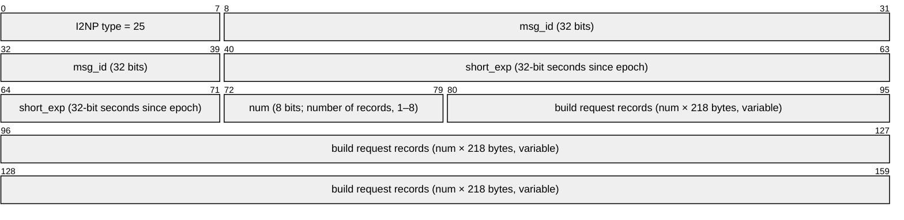

| Field | Size | Description |
|-------|------|-------------|
| num | 1 byte | Number of build request records (1–8) |
| records | num × 218 bytes | Concatenated encrypted build request records |

Extra records beyond the tunnel hop count are fake records for anonymity.
Implemented in `m:i2p_i2np:short_tunnel_build/1` and
`m:i2p_i2np:decode_short_tunnel_build/1`.

**Encrypted build request record** (218 bytes):

| Bytes | Contents |
|-------|----------|
| 0–15 | Hop's truncated identity hash (first 16 bytes of SHA-256 of RouterIdentity) |
| 16–47 | Sender's ephemeral X25519 public key (little-endian) |
| 48–201 | ChaCha20 encrypted plaintext record (154 bytes) |
| 202–217 | Poly1305 MAC (16 bytes) |

**Plaintext record** (154 bytes):

| Bytes | Contents |
|-------|----------|
| 0–3 | Receive tunnel ID (nonzero) |
| 4–7 | Next tunnel ID (nonzero) |
| 8–39 | Next router identity hash (32 bytes) |
| 40 | Flags: bit 7 = IBGW (allow from anyone), bit 6 = OBEP (reply to next hop) |
| 41–42 | More flags, unused, 0 |
| 43 | Layer encryption type: 0 = AES-256-CBC |
| 44–47 | Request time (minutes since epoch, rounded down) |
| 48–51 | Request expiration (seconds since creation; currently 600) |
| 52–55 | Next message ID |
| 56–x | Tunnel build options (Mapping, ≤96 bytes; empty = `00 00`) |
| x–153 | Random padding |

**Record encryption** uses the Noise N pattern (`Noise_N_25519_ChaChaPoly_SHA256`):
the creator generates an ephemeral X25519 keypair per ECIES hop, performs DH
with the hop's static public key, derives a ChaChaPoly key via HKDF, and
encrypts the 154-byte plaintext with AD = h (the running hash from the Noise
handshake state). See
[ECIES Tunnel Creation](https://geti2p.net/en/docs/specs/tunnel-creation-ecies)
for the full KDF.

### OTBRM (type 26)

Outbound Tunnel Build Reply Message (type 26) carries reply records from
each hop back to the tunnel creator. The body format is identical to
ShortTunnelBuild: a count byte followed by reply records.


| Field | Size | Description |
|-------|------|-------------|
| num | 1 byte | Number of reply records (1–8) |
| records | num × 218 bytes | Concatenated encrypted reply records |

Each reply record is 218 bytes:

**Plaintext reply record** (202 bytes):

| Bytes | Contents |
|-------|----------|
| 0–x | Tunnel build reply options (Mapping; empty = `00 00`) |
| x–200 | Random padding |
| 201 | Reply byte: `0x00` = accept, `30` = TUNNEL_REJECT_BANDWIDTH |

The hop's own reply record is encrypted with ChaCha20-Poly1305 (nonce =
record position 0–7). Other records are iteratively encrypted with ChaCha20
(not AEAD) at each hop using a 12-byte IV where `iv[4] = record_position`.

**KDF for reply/layer keys** (derived from the Noise chaining key after
request record encryption):

```
keydata = HKDF(ck, ZEROLEN, "SMTunnelReplyKey", 64)
replyKey = keydata[32:63]; ck = keydata[0:31]

keydata = HKDF(ck, ZEROLEN, "SMTunnelLayerKey", 64)
layerKey = keydata[32:63]
ivKey = keydata[0:31]               %% non-OBEP hop
%% OBEP hop:
ck = keydata[0:31]
keydata = HKDF(ck, ZEROLEN, "TunnelLayerIVKey", 64)
ivKey = keydata[32:63]
```

### Tunnel build lifecycle

Processing semantics for outbound tunnel builds through ECIES-only hops,
implemented in `m:i2p_ecies`, `m:i2p_tunnel` and `m:i2p_tunnel_srv`.

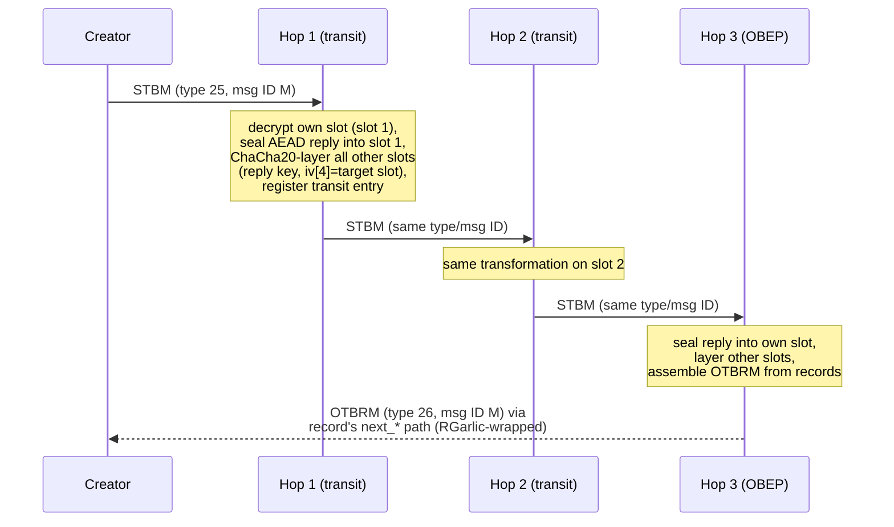

**Creator side.** `m:i2p_ecies:encrypt_build_records/3` encrypts each
154-byte request record independently (fresh Noise N state per hop) and then
**preprocesses** it: record *j* is concealed under the reply keys of every
earlier hop (positions *j*-1 … 0), each applied as raw ChaCha20 with
`iv[4] = j`. When each earlier hop later applies its own forward layering to
that slot, the layers cancel pairwise, so record *j* is plaintext-readable
exactly when the message reaches hop *j* — no hop can read another's request.
The creator retains, per position, the reply key, layer key, IV key and final
Noise hash (`t:i2p_ecies:hop_build_keys/0`) keyed by the STB's message ID.

**Hop side.** On receiving a type 25 message a hop locates its record by the
16-byte truncated identity hash prefix, Noise-N-decrypts it, and rejects or
drops:

| Condition | Action |
|-----------|--------|
| No record prefix matches our hash | drop silently |
| Noise N decrypt fails | drop silently |
| `layer_enc_type ≠ 0` | drop silently |
| Non-endpoint record whose next router hash is ours | drop silently |
| Duplicate receive-tunnel ID / capacity limit | reply ret `30`, still relay |

An accepting or relaying hop then seals its own slot with
AEAD_ChaCha20-Poly1305 (`reply_key`, nonce = own position, AD = Noise hash,
202-byte plaintext with ret code at offset 201) and ChaCha20-layers every
other slot with its reply key and `iv[4] = target position`. Transit hops
forward the modified type 25 message (same message ID) to the record's
next router; the endpoint converts the records to an OTBRM (type 26, same
message ID) and sends it down the reply path named in its record.

**Creator post-processing.** `m:i2p_tunnel:process_otbrm/2` peels slot *j*'s
surviving layers — exactly the reply keys of hops *j+1 … N-1*, since earlier
hops' layers cancelled their preprocessing counterparts — then opens each
hop's AEAD reply. Any open failure invalidates the whole build; any nonzero
ret code drops it. All-zero ret codes activate the tunnel.

Transit participation is complete; inbound tunnels, IBGW roles,
OBEP-for-others roles and RGarlic-wrapped OTBRM delivery are all
implemented. Client tunnel pools, creator injection into
outbound tunnels and lease-based addressing are implemented.

### Garlic Message (type 11, ECIES)

A Garlic Message wraps one or more Garlic Cloves, each carrying its own
delivery instructions and I2NP payload. This is the **end-to-end** encryption
layer — cloves are not decrypted by intermediate tunnel hops. Tunnels handle
the hop-by-hop layered encryption at a lower level (see Tunnel Message below).

This implementation uses ECIES-X25519-AEAD-Ribonly (the only garlic type
supported by modern I2P routers). The legacy ElGamal/AES garlic format is
not supported.

#### Router-directed ECIES Garlic Block

When the garlic message targets a single router (e.g. a tunnel message or
router-specific control message), the encrypted block uses Noise N (one-way
anonymous) with the target router's static X25519 key.

**Wire format:**

| Field | Size | Description |
|-------|------|-------------|
| length | 4 bytes | Big-endian byte count of the data that follows (ephemeral key + ciphertext + tag) |
| aepk | 32 bytes | Ephemeral X25519 public key (Noise N init) |
| encrypted | variable | ChaCha20-Poly1305 ciphertext |
| tag | 16 bytes | Poly1305 authentication tag (appended by AEAD) |

**Noise N initialization state:**

```
h  = SHA256("Noise_N_25519_ChaChaPoly_SHA256")
ck = h
h  = MixHash(h, targetStaticKey)   %% target router's X25519 public key
```

The Noise N packet is then: `aepk ‖ AEAD(plaintext, nonce=Zero, AD=h)`.

The AD (h) is bound to the target's static key, so the ciphertext can only
be decrypted by the holder of the corresponding X25519 private key.

**Implementation:** `m:i2p_garlic` exposes `wrap_router/2` and `wrap_router/3`
to build the complete I2NP Garlic message, and `unwrap_router/2` to decrypt
the data after the 4-byte length. The Noise N state machine is provided by
`m:i2p_crypto` via `noise_n_initialize/0`, `noise_n_encrypt/5`, and
`noise_n_decrypt/6`.

#### TLV Garlic Payload (inside the ECIES encrypted block)

The plaintext inside the ECIES encryption is a sequence of **TLV blocks**:

| Field | Size | Description |
|-------|------|-------------|
| type | 1 byte | TLV block type |
| size | 2 bytes | Big-endian size of data |
| data | size bytes | Block payload |

**Known TLV block types:**

| Type | Name | Data size and 0.1.0 behavior |
|------|------|-----------------------------|
| 0 | DATETIME | Four Unix seconds. `encode_payload/1,2` emits this block first. |
| 1 | SESSION_ID | Opaque data; recognized by the decoder. |
| 2 | TERMINATION | Opaque data; recognized by the decoder. |
| 3 | OPTIONS | Opaque data; recognized by the decoder. |
| 4 | NEXT_KEY | Opaque data; recognized by the decoder. |
| 8 | ACK | Opaque data; recognized by the decoder. |
| 9 | ACK_REQUEST | Opaque data; recognized by the decoder. |
| 11 | GARLIC_CLOVE | One encoded clove: delivery instructions, the 9-byte short I2NP fields, and its body. |
| 254 | PADDING | Variable data; ignored by `extract_cloves/1`. |
| other | Unknown | Any other type, including `255`, is retained as `{unknown, N}` and ignored by the client path. There is no EXPLICIT type 255 in this implementation. |

**Implementation:** `m:i2p_garlic` exposes `encode_payload/1` and
`encode_payload/2` for the DateTime-plus-cloves payload, `decode_payload/1`
for the TLV sequence, and `extract_cloves/1` for the clove blocks.

### GarlicClove

Each GarlicClove contains delivery instructions, an I2NP message, and
metadata. Inside a garlic message the I2NP messages use the **short**
NTCP2 header (type + msg\_id + expiration), not the standard 16-byte header.

| Field | Size | Description |
|-------|------|-------------|
| Delivery Instructions | 1, 33, or 37 bytes | Local, destination/router, or tunnel form; see below |
| I2NP Type | 1 byte | I2NP message type (the client path uses type `31`) |
| I2NP Message ID | 4 bytes | Message ID |
| I2NP Expiration | 4 bytes | Big-endian seconds since epoch |
| I2NP Body | variable | The actual message payload |

The minimum encoded clove is therefore 10 bytes for LOCAL delivery (one
flag byte plus the 9-byte short I2NP prefix), 42 bytes for DESTINATION or
ROUTER delivery, and 46 bytes for TUNNEL delivery.

### GarlicClove Delivery Instructions

These are distinct from Tunnel Message Delivery Instructions. The flag byte
controls the layout:

| Bit | Meaning |
|-----|---------|
| 7 | Encrypted? (always 0 — unimplemented) |
| 6–5 | Delivery type: `00` LOCAL, `01` DESTINATION, `10` ROUTER, `11` TUNNEL |
| 4 | Delay included? (always 0 — unimplemented) |
| 3–0 | Reserved, 0 |

**By delivery type:**

| Type | Flag | Size | Layout |
|------|------|------|--------|
| LOCAL | `0x00` | 1 byte | flag only; delivered to the garlic-message recipient |
| DESTINATION | `0x20` | 33 bytes | flag + 32-byte Destination hash |
| ROUTER | `0x40` | 33 bytes | flag + 32-byte RouterIdentity hash |
| TUNNEL | `0x60` | 37 bytes | flag + 32-byte gateway-router hash + 4-byte tunnel ID |

The implementation has no 53-byte encrypted/delay form. `encode_delivery/1`
and `decode_delivery/1` handle these four forms; `encode_clove/1` and
`decode_clove/1` add the short I2NP fields and body.

### ECIES Garlic Wrap/Unwrap

The full garlic message lifecycle for **router-directed** delivery:

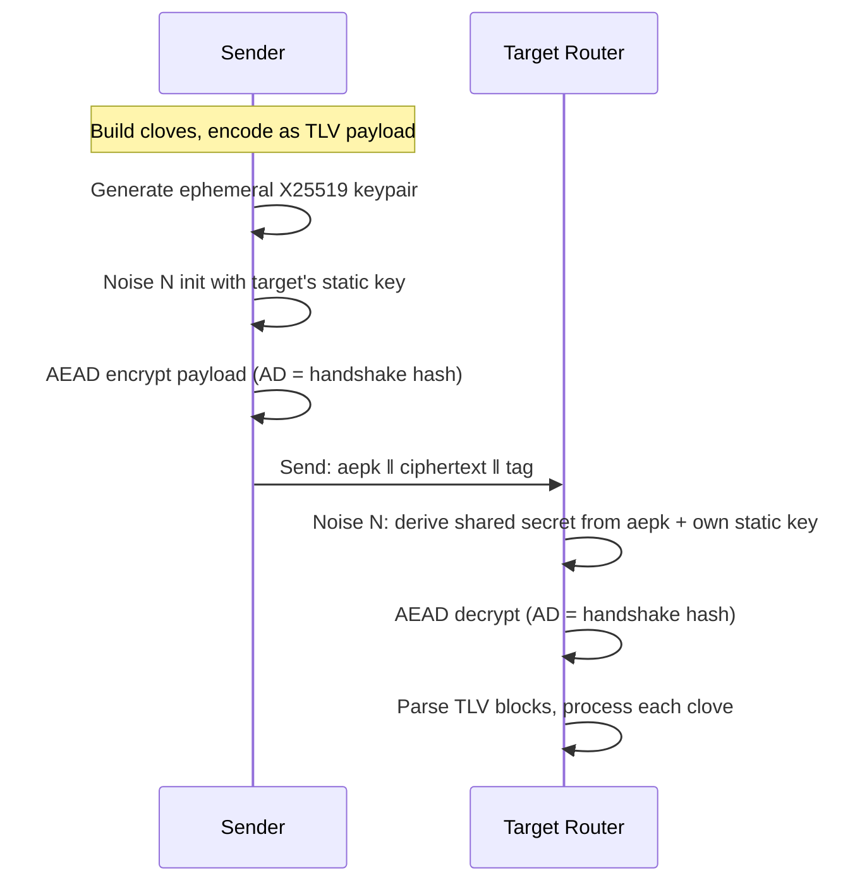

**The 0.1.0 client path is one clove.** `i2p_client:wrap_payload/2` builds
one LOCAL-delivery clove whose I2NP type is `31` (Data), with a random
4-byte message ID, a 60-second expiration, and the raw application or
streaming packet as its body. It calls `i2p_garlic:wrap_router/2` with the
Destination's X25519 public key. `i2p_client:send_wire/2` puts the resulting
Garlic body in a standard-header I2NP type-11 message and injects it through
the selected outbound tunnel toward the remote LeaseSet.

The receiver calls `i2p_client:unwrap_payload/2`, Noise-N decrypts with the
Destination private key, and requires exactly one type-`31` clove. The client
path does not add LeaseSet, DeliveryStatus, or other cloves. The generic garlic
codec can carry multiple cloves, but that is not the path used for SAM streams
or datagrams.

### Tunnel Message

Tunnel Messages carry I2NP message fragments through tunnels. They are
fixed-size (1028 bytes) to prevent size-based traffic analysis.

**Encrypted tunnel message** (wire format):

| Field | Size | Description |
|-------|------|-------------|
| Tunnel ID | 4 bytes | ID of the next hop (nonzero) |
| IV | 16 bytes | Initialization vector |
| Encrypted data | 1008 bytes | AES-256-CBC encrypted tunnel payload |

**Decrypted tunnel payload:**

| Field | Size | Description |
|-------|------|-------------|
| Checksum | 4 bytes | First 4 bytes of SHA-256(remaining bytes ‖ IV) |
| Nonzero padding | 0+ bytes | Random nonzero padding |
| Zero byte | 1 byte | `0x00` — marks end of padding |
| Delivery Instructions 1 | variable | See below |
| Message Fragment 1 | 1–996 bytes | Partial or complete I2NP message |
| … | … | Additional instruction/fragment pairs |

### Tunnel Message Delivery Instructions

These are distinct from GarlicClove Delivery Instructions. The control byte
determines the format.

**First fragment** (flag bit 7 = 0):

| Field | Size | Description |
|-------|------|-------------|
| Flag | 1 byte | bit 7: 0 = first/complete; bits 6–5: delivery type; bit 3: fragmented |
| Tunnel ID | 4 bytes | Only if TUNNEL delivery (bits 6–5 = `01`) |
| To Hash | 32 bytes | Only if ROUTER or TUNNEL delivery |
| Message ID | 4 bytes | Only if fragmented (bit 3 = 1) |
| Size | 2 bytes | Fragment length (1–996) |

Delivery types for tunnel messages: `00` LOCAL (inbound endpoint only),
`01` TUNNEL (forward to gateway router), `10` ROUTER (forward to specific
router). `11` is unused/invalid.

**Follow-on fragment** (flag bit 7 = 1):

| Field | Size | Description |
|-------|------|-------------|
| Flag | 1 byte | bit 7: 1 = follow-on; bits 6–1: fragment number (1–63); bit 0: last flag |
| Message ID | 4 bytes | Matches the initial fragment's message ID |
| Size | 2 bytes | Fragment length (1–996) |

**Tunnel encryption** uses AES-256-CBC per hop. Per the tunnel-message spec,
every participant *encrypts* one layer as it forwards (AES-ECB-encrypt the
received IV with the IV key, AES-CBC-encrypt the data under the working IV,
ECB-encrypt the working IV again for the outgoing header). Because of this
direction: an **outbound gateway** pre-applies iterative CBC *decreptions*
with every hop's layer key (endpoint's key first) so the plaintext pops out
exactly at the endpoint (`m:i2p_tunnel:obgw_prep/2`); an **inbound gateway**
applies a single layer with its own key (`m:i2p_tunnel:encrypt_layer/3`);
and the inbound-tunnel **endpoint** — the creator itself — iteratively
undoes each hop in reverse order (`m:i2p_tunnel:ibep_unwrap/2`). Layer and
IV keys are derived from the build request record KDF (see ECIES Tunnel
Creation above).

**TunnelData (type 18)** and **TunnelGateway (type 19)** are the I2NP
wrappers that carry tunnel messages between routers. TunnelData carries an
already-encrypted 1028-byte tunnel message. TunnelGateway carries a
tunnel ID + an I2NP message to be fragmented and forwarded through the
tunnel.

### Inbound tunnels

An inbound tunnel is built in the reverse topology to an outbound tunnel:
data enters at the farthest hop (the IBGW) and terminates at the creator.
Implemented in `m:i2p_tunnel_srv`.

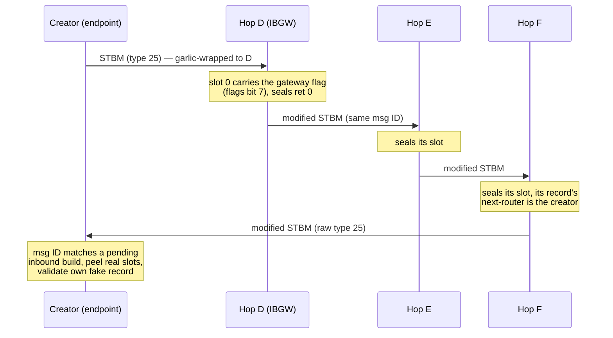

**Creator-side records.** Hops are ordered farthest-first; hop 0 carries the
IBGW flag, middle hops point onward along the build direction, and the
nearest hop's next-router is the creator's own hash with next-ID 0. A fourth
mandatory "fake" record carries the creator's truncated hash prefix and is
Noise-N encrypted to the creator's own static key — without it the nearest
hop would learn that the path terminates at its originator. The fake slot's
preprocessing layers cancel pairwise against the hops' runtime layers, so on
return it is exactly the original ciphertext and opens only with the
creator's static key, validating that no hop tampered with it.

**Data path.** Remote senders garlic-address messages to `{tunnel, IBGW_hash,
IBGW_recv_ID}`. The IBGW transit entry accepts type-19 TunnelGateway
messages, fragments them into plaintext frames addressed to the next hop
(`m:i2p_tunnel:gateway_all/4`), applies its single layer, and forwards
TunnelData. Participants encrypt one layer each. The creator-endpoint
receives frames on its endpoint receive ID, unwinds every layer
(`m:i2p_tunnel:ibep_unwrap/2`), validates the checksum, reassembles
fragments, and dispatches complete messages locally (garlic cloves go
through the same dispatcher as direct garlic).

Outbound-endpoint roles for other creators' builds and RGarlic-wrapped
OTBRM delivery are covered below.

### Outbound endpoints for other creators

When a ShortTunnelBuild slot names us with the endpoint flag (bit 6), we act
as the outbound endpoint of the creator's tunnel: after sealing our slot we
assemble all sealed records into an OTBRM (type 26, same message ID) and
send it down the reply path named in OUR record.

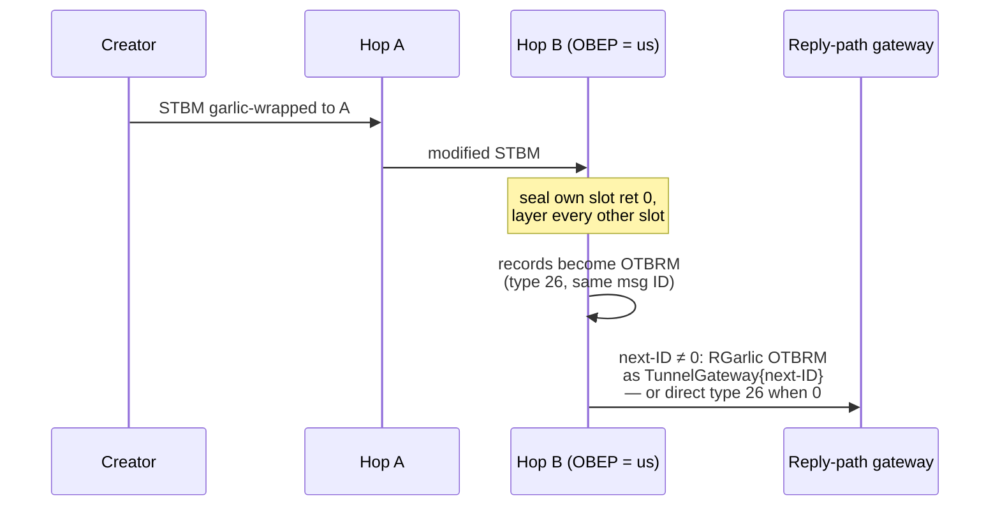

**RGarlic (Existing Session) framing.** The reply key material comes from
the OBEP's noise-chain KDF: `SMTunnelReplyKey` → `SMTunnelLayerKey` →
`TunnelLayerIVKey` → `"RGarlicKeyAndTag"`, yielding a 32-byte key and an
8-byte tag (`m:i2p_ecies:derive_obep_keys/1`). The wire frame is
`length(4) ‖ tag(8) ‖ AEAD_ChaCha20-Poly1305(payload, key, nonce=0,
AD=tag)` around a standard TLV payload carrying one local-delivery clove
with the OTBRM (per i2pd `WrapECIESX25519Message`). Implemented in
`m:i2p_garlic:wrap_existing_session/3` / `unwrap_existing_session/3`.

**Creator side.** The creator derives identical RGarlic material for its
OBEP-position hop while encrypting build records, keeps it on the pending
build, and unwraps arriving garlic messages whose leading tag matches
before falling back to Noise N. The outbound tunnel activates once
`m:i2p_tunnel:process_otbrm/2` reports all-zero ret codes.

**Creator reply paths.** Outbound builds name one of our active inbound
tunnels' gateways in their last record (`next-router` + `next-tunnel-ID`,
mirroring java's paired-tunnel selection); with no active inbound tunnel the
manager builds one first. Inbound builds keep the creator's own hash as the
nearest hop's next-router so the returning STB travels home directly.

Data-phase extraction for foreign outbound tunnels is not implemented in this
release. The client path below, including pool maintenance, creator injection,
lease addressing, and end-to-end delivery, is implemented. That gap is also
what keeps the outbound-gateway role reachable from a local caller: with no
foreign extraction there is no caller outside this router that has to play
the role, so every creator injection has a process to hand it to. Whoever
implements extraction inherits a role spread across those callers and will
have to move it back or add one more.

### Client tunnels and SAM streams

**Tunnel pool (`i2p_tunnel_srv`).** With app env `i2per` -> `tunnel_pool`
set to `#{outbound => N, inbound => M}`, a periodic tick tops each pool up:
active plus pending builds count toward the target, at most one build per
direction per tick, and outbound builds wait while an inbound build is in
flight (their reply path). Local tunnels expire after 600 s in the sweep.
`pick_outbound/0` / `pick_inbound/0` hand out random active entries.

**Outbound gateway role.** As creator of an outbound tunnel we are its
gateway: the message is fragmented (`m:i2p_tunnel:gateway_all/4`), every hop's
inverse layer is pre-applied (`m:i2p_tunnel:obgw_prep/2`) and each frame goes
to hop 1 as type-18 TunnelData. Fragment delivery instructions decide where
the far end routes the payload — `{tunnel, GatewayHash, TunnelID}` names a
remote inbound tunnel's gateway, which is how client streams reach a lease.

Which process runs that sequence depends on who is sending, and it is the
point rather than an implementation detail. `outbound_injection/1` reads the
tunnel map and returns the first hop plus this tunnel's layer keys;
`inject/3` plays the role. **A client send calls `inject/3` itself**, from the
connection's own worker, so the tunnel manager's mailbox — shared with transit
frames for other routers, tunnel builds and the pool ticks — does not carry
per-frame crypto for our users. **A lookup send stays in the manager** and
uses `send_via_outbound/3`, which calls the same `inject/3`: the lookup
orchestrator and the peer manager are singletons rather than connections, and
the peer manager is the process every send path in the router goes through.
Both charge a send that finds no active tunnel, in three separate counters —
`client_messages_dropped_no_tunnel`, `lookup_requests_dropped_no_tunnel` and
`lookup_replies_dropped_no_tunnel` — because a lost client send, a lost query
and a lost answer are three different things to be lost.

**End-to-end garlic (`i2p_client`).** Stream bytes travel as one
LOCAL-delivery clove carrying an I2NP type-`31` Data message, Noise-N wrapped
to the destination's ECIES static key (`wrap_payload/2`). The receiver opens
it with its destination private key (`unwrap_payload/2`). This is the one-clove
client path, not a multi-clove LeaseSet/ACK bundle.

**LeaseSet2 publication.** STREAM, DATAGRAM, RAW, and server destinations
record their identity with the tunnel manager (`publish_lease_set/2` or
`/3`). The freshest active inbound tunnel becomes the lease: its gateway
hash and receive ID, expiring shortly before the tunnel. Publication is
retried by the periodic tick until a tunnel exists and refreshed as tunnels
rotate. The signed LeaseSet2 is stored in the local NetDb and sent to the
closest floodfills as a direct I2NP `DatabaseStore` with `store_type = 3`.
It is not wrapped in a garlic clove.

**SAM network path.** `STREAM CONNECT` first tries local listener pairing;
otherwise the session resolves the target's LeaseSet from the NetDb, picks
its freshest lease plus one of our outbound tunnels, and pins that route.
Raw-phase socket bytes are then wrapped end-to-end and injected via the
pinned tunnel. On the receiving side, tunnel data arriving on our inbound
tunnels is unwrapped at the endpoint; garlic that the router key cannot
open is checked against every registered STREAM session's
destination key, and the session whose key opens it writes the payload to
its paired socket (`{stream_data, Payload}`).

### SAM v3

SAM (Simple Anonymous Messaging) is the client-facing TCP API for external
applications to use I2P. Implemented in `m:i2p_sam_session` (protocol handler),
`m:i2p_sam_listener` (TCP acceptor), and `m:i2p_sam_sup` (supervisor + session
registry). In the persistent (operator) boot the listener is bound
automatically on the `sam_port` app env (default 7656); explicit/test boots
start it on demand. See the full
[SAM v3 spec](https://geti2p.net/en/docs/api/samv3) for details.

**Protocol basics:**

- Line-based, newline-terminated (`\n`), UTF-8 as of SAM 3.2.
- All commands on a single TCP control socket per session.
- After `STREAM CONNECT` or `STREAM ACCEPT` succeeds, the socket switches to
  raw data mode — no more SAM commands on that socket.
- `HELLO` must be accepted before other commands. `SESSION CREATE` reports
  `RESULT=OK` as soon as the session is registered; it does not wait for a
  tunnel or LeaseSet publication. A network `STREAM CONNECT` is the operation
  that waits for the streaming SYN/SYN-ACK before reporting `RESULT=OK`.

**Key commands:**

| Command | Response | Description | Status |
|---------|----------|-------------|--------|
| `HELLO VERSION [MIN=…] [MAX=…]` | `HELLO REPLY RESULT=OK VERSION=3.1` | Required first command. The parser checks the `HELLO VERSION` shape; MIN/MAX are not negotiated and the reply version is fixed. | Implemented |
| `DEST GENERATE SIGNATURE_TYPE=7` | one base64 line | Generate an Ed25519 destination private blob | Implemented |
| `SESSION CREATE STYLE=STREAM ID=… DESTINATION=…` | `SESSION STATUS RESULT=OK DESTINATION=…` | Create a STREAM session; tunnel and LeaseSet work is asynchronous | Implemented |
| `… SESSION CREATE` with `inbound.length=N outbound.length=N` | — (options on the same command) | Per-session tunnel lengths, clamped to 1–3 hops; drive the router's tunnel-pool targets and which inbound tunnel the published lease names | Implemented |
| `STREAM CONNECT ID=… DESTINATION=…` | `STREAM STATUS RESULT=OK` | Outbound connection | Implemented |
| `STREAM ACCEPT ID=…` | base64 identity line, then raw mode | Register an inbound stream destination; the socket becomes raw immediately | Implemented |
| `STREAM FORWARD ID=… PORT=… [HOST=…]` | `STREAM STATUS RESULT=OK` | Bind a local service; every inbound stream relays to a fresh local TCP connection (control socket stays in line mode) | Implemented |
| `NAMING LOOKUP NAME=…` | `NAMING REPLY RESULT=OK NAME=… VALUE=…` | Resolve .i2p address | Implemented |
| `SESSION CREATE STYLE=DATAGRAM\|RAW ID=… DESTINATION=…` | `SESSION STATUS RESULT=OK DESTINATION=…` | Create a datagram session (stays in line mode) | Implemented |
| `DATAGRAM SEND DESTINATION=… SIZE=…\n<payload>` | — (fire-and-forget) | Send repliable datagram | Implemented |
| `RAW SEND DESTINATION=… SIZE=…\n<payload>` | — (fire-and-forget) | Send anonymous datagram | Implemented |
| *(inbound)* | `DATAGRAM RECEIVED DESTINATION=… SIZE=…\n<payload>` | Repliable datagram arrival | Implemented |
| *(inbound)* | `RAW RECEIVED SIZE=…\n<payload>` | Anonymous datagram arrival | Implemented |

```mermaid
sequenceDiagram
    participant C as Client
    participant S as SAM Bridge
    C->>S: HELLO VERSION MIN=3.1 MAX=3.1
    S->>C: HELLO REPLY RESULT=OK VERSION=3.1
    C->>S: SESSION CREATE STYLE=STREAM ID=mysession DESTINATION=… SIGNATURE_TYPE=7
    Note over S: Session registered, LeaseSet publication and tunnel work continue asynchronously
    S->>C: SESSION STATUS RESULT=OK DESTINATION=…
    C->>S: STREAM CONNECT ID=mysession DESTINATION=target…
    S->>C: STREAM STATUS RESULT=OK
    Note over C,S: Socket carries raw I2P stream data
    C->>S: (raw data bytes)
    S->>C: (raw data bytes)
```

**Session lifecycle:** A SAM session is one process tied to its TCP socket.
Closing the socket, or a protocol violation, ends that process. A monitor
removes the session's tunnel-length demand when it exits, but the shared tunnel
pools and already-published LeaseSets are not torn down merely because a
client socket closes. The current SAM ETS rows for the session, its
`STREAM ACCEPT`/`STREAM FORWARD` binding, and stream demux keys are not removed
by `i2p_sam_session:terminate/2`; stale rows can remain until overwritten.
Stream connections have their own temporary-process lifecycle. Keep sessions
for the lifetime of the client rather than rapidly creating and destroying
them.

**Destination encoding:** `DEST GENERATE SIGNATURE_TYPE=7` returns a base64
private destination blob of 455 bytes, or 608 I2P-Base64 characters:
`Destination (391) ‖ X25519 private key (32) ‖ Ed25519 signing private key
(32)`. `SESSION CREATE DESTINATION=…` accepts that full blob; omitting it
makes the bridge generate a transient identity. `SESSION STATUS` returns
only the 391-byte Destination identity in base64 (524 characters), not the
private keys. `STREAM CONNECT` and DATAGRAM/RAW targets need the 391-byte
identity prefix; trailing private-key bytes in a supplied blob are ignored.
The parser defaults `SIGNATURE_TYPE` to `7`; any other value is rejected, so
the legacy DSA-SHA1 form is not implemented.

**Tunnel-length options:** `SESSION CREATE` accepts trailing
`key=value` options; `inbound.length=N` / `outbound.length=N` set the hop
count the router maintains for that session's tunnels. Values are clamped
into 1..3 (the router's practical tunnel budget); a non-integer value is a
protocol violation and kills the session. Demanded lengths feed the tunnel
manager's pool targets — at least one active or pending tunnel per direction
per demanded length exists while the session lives — and a session's
published LeaseSet names an inbound tunnel of its demanded `inbound.length`
when one exists. Options left out mean "no opinion": no demand is
registered and defaults apply.

**STREAM FORWARD:** where ACCEPT hands the whole client socket to a
single stream, FORWARD keeps the control socket in line mode and binds the
destination to a local host:port service (`HOST` defaults to 127.0.0.1).
Each inbound peer stream is answered by its own accept-role streaming
connection whose bytes pipe bidirectionally to a fresh local TCP connection;
any number of streams may be relayed concurrently. The binding is intended to
live until the session dies, but the current ETS cleanup gap can leave a stale
binding after the process exits. A refused local dial answers the peer with a
graceful CLOSE.

```mermaid
sequenceDiagram
    participant R as Remote peer
    participant S as SAM FORWARD session
    participant L as Local service (HOST:PORT)
    participant C as SAM control socket
    Note over S: STREAM FORWARD ID=n PORT=p registered
    R->>S: SYN (through tunnels)
    S->>R: SYN-ACK
    S->>L: TCP connect
    R->>S: stream data
    S->>L: raw TCP payload
    L-->>S: response bytes
    S-->>R: stream data
    Note over C: control socket still line-mode<br/>(more commands allowed)
```

**Streaming over tunnels:** SAM STREAM sessions use I2P's streaming library
for reliable ordered delivery, as described in the [Streaming
protocol](#streaming-protocol) section below. The same-node local pairing
(`STREAM ACCEPT` + `CONNECT` on one router) remains a direct socket pipe that
bypasses tunnels entirely.

### LeaseSet2

LeaseSet2 is the standard, signed LeaseSet advertisement stored under a
Destination's hash. i2per implements the published, unencrypted LeaseSet2
form: the Destination identity, publication and lifetime fields, properties,
encryption keys, leases, and an Ed25519 signature. The DatabaseStore
`store_type` byte is external to this content and is `3` for LeaseSet2.

```mermaid
packet
0-3127: "Destination identity (391 bytes for X25519 + Ed25519)"
3128-3191: "published (32-bit seconds since epoch)"
3192-3207: "expires (16-bit days) and flags (16 bits)"
+3208: "properties Mapping, key count and keys, lease count and 40-byte leases, signature"
```

| Field | Size | Description |
|-------|------|-------------|
| identity | 391 bytes | Standard Destination KeysAndCert: X25519 public key, ten repeated 32-byte padding blocks, Ed25519 public key, and KEY certificate. |
| published | 4 bytes | Big-endian Unix seconds when the LeaseSet was published. |
| expires | 2 bytes | Big-endian lifetime in days. |
| flags | 2 bytes | Big-endian feature flags. i2per builds and accepts flags `0`; offline, unpublished, and blinded forms are rejected. |
| properties | variable | A 2-byte Mapping size followed by that many bytes of sorted `key=value;` pairs. An empty Mapping is `00 00`. |
| number of keys | 1 byte | Number of encryption-key records; the builder emits one. |
| key record | 4 + key length | `enc_type` (2 bytes, `4` for X25519), `key_length` (2 bytes, `32` for the emitted key), then the key bytes. |
| number of leases | 1 byte | Number of lease records, at most 16. |
| lease record | 40 bytes | `gateway` (32 bytes) ‖ `tunnel ID` (4 bytes, big-endian) ‖ `end date` (4 bytes, big-endian milliseconds; the field wraps in 2106). |
| signature | 64 bytes | Ed25519 signature by the Destination signing key. |

The signature covers the external store-type byte followed by every LeaseSet2
content byte before the signature: `0x03 || identity || published || expires
|| flags || properties || key count || keys || lease count || leases`.
`i2p_leaset:to_binary/1` returns the signed content without that external
byte; `i2p_i2np:db_store/5` places store type `3` immediately before the
content in a DatabaseStore body. The LeaseSet2 content is not an encrypted
blob: its properties, keys, and leases are carried in the signed clear form
above.

### Streaming protocol

TCP-like reliable ordered transport carried as the payload of end-to-end
garlic Data cloves — one packet per clove, no length field. Implemented in
`m:i2p_streaming` (codec) and `m:i2p_stream_conn` (per-connection state
machine), integrated into the SAM bridge. Spec:
[Streaming Protocol Specification](https://geti2p.net/en/docs/spec/streaming).

```mermaid
packet
0-31: "sendStreamId (32 bits)"
32-63: "receiveStreamId (32 bits)"
64-95: "sequenceNum (32 bits; 0 without SYN = plain ACK)"
96-127: "ackThrough (32 bits, cumulative)"
128-135: "nackCount (8 bits; 8 on SYN = replay-hash form)"
+136: "NACK words, resendDelay, flags, optionSize, options, and payload"


```

| Field | Size | Description |
|-------|------|-------------|
| sendStreamId | 4 | The **peer's** stream ID (see direction rule below); 0 in the initiator's SYN. |
| receiveStreamId | 4 | The sender's own stream ID. |
| sequenceNum | 4 | 0 on SYN/SYN-ACK/plain ACKs, then 1, 2, ... per direction; retransmissions reuse the number. |
| ackThrough | 4 | Highest in-order sequence received; ignored when NO_ACK is set. |
| nackCount + NACKs | 1 + 4n | Missing sequences below ackThrough. On SYNCHRONIZE: count=8 carrying the recipient's destination hash (replay prevention, protocol >= 0.9.58). |
| resendDelay | 1 | Advisory retransmission delay in seconds; ignored on receive. |
| flags | 2 | Bitfield, see below. |
| optionSize + options | 2 + n | Supported options are emitted in wire order: DELAY (2) ‖ FROM (391) ‖ MAX_PACKET_SIZE (2) ‖ SIGNATURE (64). OFFLINE_SIGNATURE is rejected. |

**Flags** (bit 0 = LSB): `0x0001` SYNCHRONIZE, `0x0002` CLOSE, `0x0004`
RESET, `0x0008` SIGNATURE_INCLUDED, `0x0010` SIGNATURE_REQUESTED (defined
but not set by this implementation), `0x0020` FROM_INCLUDED, `0x0040`
DELAY_REQUESTED, `0x0080` MAX_PACKET_SIZE_INCLUDED, `0x0100`
PROFILE_INTERACTIVE (defined but ignored), `0x0200` ECHO (defined but unused),
and `0x0400` NO_ACK. `0x0800` OFFLINE_SIGNATURE is rejected on decode.

**Signatures.** SYNCHRONIZE, CLOSE and RESET carry Ed25519 signatures over
the entire wire form with the signature space zeroed, keyed by the
FROM destination's signing key. A bad signature, a replay-hash mismatch or
an unparsable FROM destination is a protocol violation: the connection
process dies (`exit({protocol_error, _})`) and nothing retries in-process.

**Stream-ID direction rule** (matches i2pd's `Streaming.cpp`): each side
picks one random nonzero ID at creation. Every outgoing packet carries
`sendStreamId = peer's ID`, `receiveStreamId = my ID`; an initiator sends
`sendStreamId = 0` until the SYN reply reveals the peer's pick. Incoming
packets are demuxed by our own ID arriving in *their* sendStreamId field —
the `(destination, streamId)` registry key in `m:i2p_sam_sup`.

```mermaid
sequenceDiagram
    autonumber
    participant A as Initiator (SAM CONNECT)
    participant B as Responder (pending STREAM ACCEPT)
    Note over A: conn started, SYN sent (seq 0,<br/>NO_ACK, FROM+SIG, replay=hash(B))
    A->>B: SYN via outbound tunnel -> B's lease
    Note over B: verify sig (key from FROM),<br/>replay hash == own dest hash<br/>-> spawn accept-role conn
    B->>A: SYN-ACK (seq 0, sendStreamId = A's ID)
    Note over A: adopt peer ID, STATUS OK to client
    A->>B: DATA seq 1 (payload <= MTU), piggyback ackThrough
    B-->>A: plain ACK seq 0 (ackThrough, NACKs if gaps)
    B->>A: DATA seq 1 (reverse direction shares nothing but IDs)
    A->>B: CLOSE (signed)
    B->>A: CLOSE (signed) - both owners notified
```

**Reliability model.** The current implementation uses a fixed-size window of
unacknowledged packets (default 8), immediate plain ACKs, double-NACK fast
retransmit, and a 1 s retransmission round resending all unacked packets plus
an unanswered CLOSE. After 15 silent rounds the owner receives
`{stream_reset, Conn}` and the process dies. Recovery lives above the
connection.

**MTU.** `i2p_stream_conn` starts with its local `mtu` option (default 1730).
Both the signed SYN and signed SYN-ACK carry a positive local value in the
`MAX_PACKET_SIZE` option (`0x0080`). After authenticating the peer handshake,
each side normalizes the peer offer using I2P Java's rules: a missing offer
falls back to 1730 bytes, and a positive offer below 512 is raised to 512. An
explicit zero is a protocol error because it cannot carry payload. The local
value is used as supplied. Each side then sets its outbound payload chunk size
to the smaller of its local value and the normalized peer offer. The negotiated value limits application payload
chunks; the streaming header and options are added around each chunk. This
release has no RTT-based or window-based congestion control.

**SAM integration.** `STREAM CONNECT` first tries same-router listener
pairing, which reports `RESULT=OK` immediately. Otherwise it resolves the
route, starts a streaming connection, and reports `RESULT=OK` only after the
signed SYN-ACK arrives; a failed or 15-second-timed-out handshake reports
`CANT_REACH`. An inbound SYN for a pending `STREAM ACCEPT` spawns the
accept-role connection, answers the handshake, and pairs the socket.

### SU3 reseed files

The bootstrap envelope: an HTTPS-fetched, RSA-signed container whose zip
payload holds RouterInfo `.dat` files for a fresh NetDb. Implemented in
`m:i2p_su3` (codec + signature verification), `m:i2p_reseed` (fetch/unpack
pipeline) and `m:i2p_reseed_srv` (the one-shot supervisor worker). Spec:
[Software Update Specification](https://geti2p.net/en/docs/spec/updates),
section "SU3 File Specification".

```mermaid
packet
0-5: "magic \"I2Psu3\" (6 bytes)"
6: "unused = 0"
7: "SU3 format version = 0"
8-9: "signature type (16 bits; 0x0006 = RSA-SHA512-4096)"
10-11: "signature length (16 bits; 512 for type 6)"
12: "unused = 0"
13: "version length (>= 16)"
14: "unused = 0"
15: "signer ID length"
16-23: "content length (64 bits, big-endian)"
24: "unused = 0"
25: "file type (0 = zip)"
26: "unused = 0"
27: "content type (3 = reseed data)"
28-39: "reserved zeros (12 bytes)"
+40: "version, signer ID, content, and signature (lengths come from the header)"
```

| Field | Size | Description |
|-------|------|-------------|
| magic | 6 | `"I2Psu3"` — anything else is refused before any field is parsed. |
| format version | 1 | Must be 0. |
| signature type | 2 | Only `0x0006` (RSA-SHA512-4096) is implemented — the type every live reseed uses. Others are rejected with `{unsupported_signature_type, T}`. |
| signature length | 2 | Must be 512 for type 6. |
| version length | 1 | At least 16 bytes; shorter is a spec violation (`short_version`). |
| signer ID length | 1 | Length of the signer identity; it must match an X.509 subject common name (CN). |
| content length | 8 | Big-endian 64-bit payload size. |
| file type | 1 | Reseed files are zip (`0`). |
| content type | 1 | Reseed data is `3`; other values are refused as `not_a_reseed_file`. |
| version | >= 16 | UTF-8, zero-padded to the declared length (epoch seconds for reseeds); padding is stripped after decode. |
| signer ID | n | Matched **exactly** against the X.509 certificate subject CN in the trust store. The certificate filename is not the trust identity. |
| content | n | Zip archive of top-level `routerInfo-<base64 hash>.dat` files. |
| signature | 512 | RSASSA-PKCS1-v1_5 ("NONEwithRSA") over the SHA-512 digest of bytes 0 through end-of-content. |

**Trust model.** The SU3 carries no certificate. The trust store maps each
local X.509 certificate's **subject CN** to its DER bytes, and the SU3 signer
ID is looked up in that map. Verification order: trust lookup
(`{unknown_signer, Id}`) → anchor validity window
(`{signer_cert_expired, Id}`, per the spec's advice to enforce certificate
dates) → signature (`bad_signature`). Decoding is strict: wrong magic/format
version, unsupported types, short versions, truncation and trailing bytes are
all distinct errors.

**Fetch path.** `<host>/i2pseeds.su3?netid=<n>` over HTTPS for the default
production mirrors. `fetch/1` also accepts a caller-supplied HTTP URL, which
is useful for local or private test mirrors. Hosts are tried in order until one
yields RouterInfos; TLS uses the OS trust store, while the SU3 signature is
what authenticates the payload.

### Remote NetDb lookups through tunnels

How a router resolves a LeaseSet/RouterInfo it does not hold: DatabaseLookup
queries are pushed through the node's own outbound tunnels and answered into
its inbound tunnel, so neither side needs a direct connection. Implemented in
`m:i2p_lookup_srv` (orchestrator), `m:i2p_i2np` (`f:i2p_i2np:db_lookup_via_tunnel/5`)
and the tunnel-reply branch of `m:i2p_peer`'s lookup handler; SAM STREAM
CONNECT consults it before reporting `CANT_REACH`.

```mermaid
sequenceDiagram
    autonumber
    participant A as Requester (lookup_srv)
    participant O as A's outbound tunnel
    participant F as Floodfill
    participant I as A's inbound tunnel
    Note over A: pick inbound lease (gw=GA, tid=RA)<br/>pick outbound tunnel
    A->>O: DatabaseLookup(key, from=A, flags=LS|tunnel-reply, replyTid=RA)<br/>ROUTER delivery to F
    O->>F: std I2NP type 2 (OBEP connects/sends)
    alt F holds the record
        F->>I: DatabaseStore(type 3 LS2) via F's outbound pool,<br/>TUNNEL delivery {tunnel=GA, tid=RA}
        I->>A: unwrap -> store into NetDb -> resolve waiters
    else F knows closer routers
        F->>I: DatabaseSearchReply(peers)
        I->>A: chase queue += peers, next attempt immediately
    end
```

**Wire details.** The tunnel-reply flag is bit 0 of the DatabaseLookup flags
byte. With that bit clear, the excluded count follows the flags byte directly.
With it set, a 4-byte reply tunnel ID is inserted before the excluded count;
the `from` field remains the requesting router's hash. The responder uses
that hash with the reply tunnel ID as `{tunnel, from, replyTid}` delivery.
`f:i2p_i2np:decode_db_lookup/1` surfaces the conditional field as
`delivery`. Responder answers choose per-type stores: DatabaseStore
`store_type = 0` for RouterInfo or `3` for LeaseSet2; anything else gets a
DatabaseSearchReply naming the four closest known hashes minus the asker's
exclusions.

**Retry policy.** Up to three floodfills closest to the key are tried in turn,
then the chase queue (peers suggested by search replies, contacted directly by
router delivery). Attempts time out after 4 s each; stale timeouts carry a
reference token so a late timer cannot advance an already-chased lookup. After
five attempts or an 18 s overall deadline the lookup fails with `not_found`
and all blocked callers — typically SAM CONNECT sessions — are released.

**Clock conventions.** RouterInfo timestamps travel as milliseconds;
LeaseSet validity is seconds-since-epoch. Store paths stamp each record kind
with its own clock before handing off to the NetDb.

### Address book and hosts.txt

Name-to-destination mapping for `.i2p` hostnames, implemented in
`m:i2p_addressbook` (the store) and `m:i2p_addressbook_subs` (subscription
fetcher). Format follows the standard hosts.txt convention: one
`name.i2p=base64destination` per line, `#` comments, names compared
case-insensitively.

**Store.** When app env `i2per` -> `data_dir` is set the book loads
`<data_dir>/hosts.txt` at startup and appends every new entry back to it;
without a data dir it runs memory-only. Entries live in the server's state
(reads and writes are serialised through one gen_server).

**NAMING LOOKUP integration.** SAM name resolution covers three forms:
base64 destinations pass through unchanged, `.b32.i2p` addresses look the
LeaseSet up by hash, and anything else resolves through the address book.

**STREAM CONNECT integration.** A CONNECT whose DESTINATION fails base64
decoding is treated as a hostname and resolved through the book before the
route attempt; unknown names report `CANT_REACH`.

**Subscriptions.** Configured via app env
`addressbook => #{subscriptions => [#{host, dest_b64}], interval_min => N}`;
the fetcher holds a persistent internal client destination that participates
in inbound delivery alongside SAM sessions (`f:i2p_addressbook_subs:client_destinations/0`,
consumed by the tunnel dispatcher's unwrap scan). Each fetch opens a real
streaming connection to the subscription's lease — signed SYN bound to the
site's destination hash, buffered HTTP GET flushed on establishment — and
merges every fetched entry into the store. The first fetch fires on boot;
refreshes default to hourly.

### Server tunnels

A local TCP service is published as an I2P destination by `m:i2p_server_tunnel`.
Services can be declared in the `i2per` application environment or in
`tunnels.conf`; each declaration gets one process.

**Destination identity.** Each service loads or generates its destination keys
at `<data_dir>/<name>.keys` — the base64 private destination blob — so the
published address is stable across restarts. Without a data dir the service is
ephemeral.

**Publication.** The signed LeaseSet2 reuses the client path: the freshest
inbound tunnel becomes the lease (`m:i2p_tunnel_srv:publish_lease_set/2`) and
the tick republishes as tunnels rotate. The destination joins the inbound
unwrap scan next to SAM sessions (`f:i2p_server_tunnel:client_destinations/0`).

**Inbound streams.** A garlic that opens under the service key carries one
streaming packet. A SYN whose replay hash binds this destination starts an
accept-role streaming connection plus a TCP connection to the declared
host:port — one relay per peer stream, demuxed by the streaming stream ID the
connection announces. Bytes are piped both directions until either side closes;
a dead local service kills only that relay.

Route resolution and the garlic-over-tunnel transport are shared with SAM:
`f:i2p_client:route_to_dest/1` (local NetDb first, then a tunnel-based remote
lookup) and `f:i2p_client:send_wire/2`.

### SAM datagrams end-to-end

Repliable and anonymous datagrams share the streaming transport's framing
rule: one datagram per garlic Data clove, no length field. The codec is
`m:i2p_datagram`; SEND/RECEIVED plumbing lives in `m:i2p_sam_session`.
Specs: [Datagrams](https://geti2p.net/en/docs/specs/datagrams),
[SAM v3](https://geti2p.net/en/docs/api/samv3).

**Demux by session style, not by sniffing.** A destination carries exactly
one client form. `f:i2p_sam_sup:client_sessions/0` enumerates every session
style for the tunnel manager's unwrap scan; the opened payload goes to the
owning session as `{stream_data, Wire}` and that session dispatches by its
SESSION CREATE style. STREAM sessions feed streaming packets to their
connection; DATAGRAM and RAW sessions decode datagrams.

#### Datagram1 (repliable) wire format

```mermaid
packet
0-390: "from — sender Destination (391 bytes)"
391-454: "signature — Ed25519 over payload (64 bytes)"
+455: "payload (variable, application bytes)"
```

| Field | Size | Description |
|-------|------|-------------|
| from | 391 | Sender Destination (X25519 ‖ padding ‖ Ed25519 ‖ KEY cert), same fixed layout as every destination in this router. Its signing key verifies the signature. |
| signature | 64 | Ed25519 over the **payload bytes only** (non-DSA rule, release 0.9.14+). Datagram2 replay protection is not implemented in 0.1.0. |
| payload | 1..~11 KB practical | Application bytes. Unreliable and unordered end-to-end. |

RAW datagrams carry no header at all: the Data-clove payload is the
message, and receivers cannot attribute or authenticate it.

**Authentication is fail-closed:** a malformed frame, an unparsable `from`,
or a failed signature all return `error` from `f:i2p_datagram:decode/1`
and are dropped silently — exactly what an unauthenticated stranger
deserves.

#### Control-socket protocol

The v1/v2-compatible commands on the session socket (the UDP port-7655
forwarding path is not implemented). There is no `ID=` parameter: the
socket that owns the DATAGRAM/RAW session sends on it. Payload size above
32 KB, or any SEND on a STREAM-style session, is a protocol violation —
the session process dies (`exit({protocol_error, _})`). An unroutable
target drops silently; there is no STATUS reply for datagrams.

```mermaid
sequenceDiagram
    autonumber
    participant CA as SAM client A
    participant SA as Session A (STYLE=DATAGRAM)
    participant SB as Session B (STYLE=DATAGRAM)
    participant CB as SAM client B
    Note over CA,CB: both destinations have published LeaseSet2s<br/>(SESSION CREATE publishes for every style)
    CA->>SA: DATAGRAM SEND DESTINATION=b64(B) SIZE=n\npayload
    Note over SA: i2p_datagram:encode(from=A, seed, payload)<br/>route_to_dest(B) + send_wire via outbound tunnel
    Note over SB: unwrap scan opens the garlic under B's key<br/>-> {stream_data, wire} -> verify signature
    SB->>CB: DATAGRAM RECEIVED DESTINATION=b64(A) SIZE=n\npayload
```

### SSU2 transport

UDP transport: one datagram per message, Noise XK handshake
(`Noise_XKchaobfse+hs1+hs2+hs3_25519_ChaChaPoly_SHA256`) with header
obfuscation under the responder's introduction key, token-gated session
establishment and a ChaCha20-Poly1305 data phase. Implemented in
`m:i2p_ssu2` (codec), `m:i2p_ssu2_listener` (socket owner + inbound
classification) and `m:i2p_ssu2_conn` (one process per session).
Spec: [SSU2 Specification](https://i2p.net/en/docs/specs/ssu2/).

The router operator sets app env `i2per` -> `ssu2` to one of `no_udp`
(default), `enable_udp`, or `prefer_udp`. Either of the last two makes the
persistent boot bind a UDP listener (owner `m:i2p_peer`) and advertise the SSU2
RouterAddress next to NTCP2; `prefer_udp` additionally makes outbound dials reach
for SSU2 first. The three values are the coherent combinations of two independent
properties — serving a transport, and preferring it when dialing — so
`enable_udp` (serve UDP, dial NTCP2 first) is expressible and the incoherent
fourth (serve nothing, dial UDP) is not. The handshake and data phase can be
verified against a live i2pd with `scripts/interop_i2pd.sh`.

#### Outbound connection selection

For outgoing connections `m:i2p_peer` prefers SSU2 and falls back to NTCP2.
A peer's SSU2 dial is skipped — leaving NTCP2 — when `ssu2` is not `prefer_udp`
(which includes `enable_udp`: the listener is bound, and no dial uses it), when
this router has no local SSU2 listener, or when the remote RouterInfo carries
no usable SSU2 address. When a dial is attempted and the handshake fails or
times out (the remote's SSU2 address answers nothing), the dialog repeats over
NTCP2, so the queued work (exploratory lookups, RouterInfo announcements)
completes regardless of which transport ultimately connects. The selected and
live transport is reported by `f:i2p_peer:status/0` (`transport := ntcp2 |
ssu2`).

The handshake itself blocks in a short-lived dial process (it is what drives
SSU2-then-NTCP2 fallback); on success the established SSU2 session is handed
to the peer manager via `f:i2p_ssu2_conn:set_owner/2` so its data messages
reach the manager, mirroring NTCP2 where the connection is born owned by the
manager.

The SessionRequest is re-sent every `handshake_retry_ms` (`i2per` env, default
1000 ms) until a SessionCreated arrives; after `handshake_max_resends`
(default 9) unanswered retransmits the connection exits
`{handshake_timeout, Phase}` — a ~10 s establishment budget that tolerates
loss while still bounding the stuck-remote case that SSU2-then-NTCP2 fallback
recovers from. Both values are read from the `i2per` application environment
when the retransmit timer is armed.

#### Why a dial was parked

Every time a dial gives up on SSU2 and repeats over NTCP2, the reason it gave up
is announced as `{ssu2_dial_parked, PeerHash, Reason}` and charged to
`ssu2_dials_parked`. A dial that never tried SSU2 is `not_attempted` and is
neither announced nor counted. See #1Q4JREN.

The point of the reason is one bit: **did something come back.**
`{protocol_error, _}` means a datagram arrived and could not be used, which is
proof that UDP works in that direction; `{handshake_timeout, _}` and `timeout`
mean silence. A single dial cannot tell silence from our own UDP being blocked,
from the peer being down, or from a middlebox — the three are
over-determined. Across peers it can: SSU2 timing out for every peer while NTCP2
succeeds for every peer means the common cause is ours, which is the one an
operator can act on.

This is a separate fact from `peer_connect_failed`, which fires only once *both*
legs have failed and so never fires for the peer a park usually concerns: one that
connected over TCP and left a UDP stall behind. The other three reasons —
`{relay_rejected, _}`, `{relay_bad_response_sig, _}` and
`{session_admission_failed, _}` — are the introducer leg, so they only appear on
the firewalled-remote path.

#### Seeing a park while it is happening

The counter and the event are reported *after* a park ends. A park is up to ~10s
direct and up to ~60s through an introducer, and for that whole time the peer is
still `connecting` — so the read API has to describe the attempt in progress, not
only its outcome.

`i2p_peer:status/0` reports `transport` as **the transport being attempted**, and
the dialing process announces each attempt to the manager as it makes it. Before
this, `transport` was only ever the value the peer entry was created with —
`ntcp2`, the fallback — so a peer parked mid-SSU2 reported the fallback as though
it had already happened, for the entire park.

`last_attempt` (unix seconds) is the companion field. `connecting` at
`attempts = 0` is what a healthy dial looks like five milliseconds in, so the
attempt count cannot say a dial is stuck; the *age* of `last_attempt` can.

In the aggregated read API, `peers` is `#{connected, connecting, other}`.
`connecting` is a **subset** of `other`, not a bucket carved out of it: `other`
still counts every peer that is not connected, so a consumer reading version 1 of
the map gets the same number it always did. The backoff count is therefore
`other - connecting`. See #X7BP9G1.

#### Leaving `connecting`

A peer reaches `connecting` when `f:maybe_connect_status/3` spawns a dial, and it
leaves when something says what the dial did: `{conn_started, ...}` for a
connection, `{ssu2_ready, ...}` for an SSU2 session, `{connect_failed, ...}` for a
failure. All three are messages **from the dial**, and the dial is an unlinked
spawn — a raise on that path must not take the peer manager down, since every send
the router makes runs through it. So a dial that raises between two of those
messages says nothing at all, and before #8V1Z06A nothing else could: the peer sat
at `connecting` for the life of the process, because `f:sweep_peers/1` deliberately
never evicts a `connecting` peer (evicting would let the dial complete into an
entry that is gone, and `f:handle_conn_started/4` stops a connection for an unknown
peer).

Two escapes close that, and both are counted `dials_escaped`:

- **the dial's monitor.** `f:start_dial/3` spawns with `spawn_monitor/1`, so a
  dial that ends reports `{dial_died, Reason}` on `peer_connect_failed` — carrying
  the exit reason, which is the whole diagnosis (`true = is_pid(Manager)` in
  `f:attempt_announced/2` raises `{badmatch, false}`, and that is now visible
  rather than silent).
- **a deadline on `connecting`**, because a monitor only reports a dial that
  *ends*. A dial blocked forever on a socket produces nothing to report, so
  `dial_deadline_ms` (app env `i2per`, default the SSU2 leg budget plus an NTCP2
  handshake plus margin) ends the dial with a `dial_deadline` reason and stops the
  dial process. The default is **derived** from the legs rather than written down
  — `f:i2p_ssu2_conn:dial_budget_ms/0` is the longer of the direct handshake's
  retransmit budget and the introducer leg's redirect wait — so retuning
  `handshake_retry_ms` / `handshake_max_resends` widens it with them.

A dial that dies *after* handing over a connection is neither escape. The peer
stays `connecting` on purpose, because NTCP2's handshake has not answered yet, and
the connection's own monitor releases it from there through `peer_disconnected` —
`ntcp2_connect/4` sends `conn_started` and returns in the same breath, so every
NTCP2 dial's `DOWN` follows a successful hand-over.

`dials_escaped` is a statement about **this** router, where every ordinary connect
failure is a statement about the remote: a non-zero value means a raise on the dial
path, or a blocking call that stopped honouring its own bound. The reason is on the
event, since "raised" and "never returned" are not the same fault.

#### Handshake sequence

```mermaid
sequenceDiagram
    participant A as Alice (initiator)
    participant B as Bob (responder)
    A->>B: TokenRequest (type 10, token=0)
    B-->>A: Retry (type 9, grants 8-byte token)
    A->>B: SessionRequest (type 0, X obfuscated, carries token)
    B-->>A: SessionCreated (type 1, Y obfuscated)
    A->>B: SessionConfirmed (type 2, static key + RouterInfo, <=15 fragments)
    B-->>A: Data (packet 0: ACK of Alice's packet zero / DateTime)
    Note over A,B: data phase keys k_ab/k_ba via split()
```

#### Header layouts

Long header (32 bytes; SessionRequest/TokenRequest/Retry — plaintext form):

| Field | Size | Description |
|-------|------|-------------|
| destination connection ID | 8 | Random, chosen by the sender of the first message; routing key. |
| packet number | 4 | Random and ignored on TokenRequest/Retry/SessionRequest. |
| type | 1 | 0 = SessionRequest, 7 = PeerTest, 9 = Retry, 10 = TokenRequest, 11 = HolePunch. |
| ver | 1 | 2. |
| net ID | 1 | 2 (mainnet). |
| flags | 1 | 0. |
| source connection ID | 8 | Sender's own id; must differ from destination. |
| token | 8 | Granted by Bob in a Retry; 0 otherwise. |

Short header (16 bytes; SessionConfirmed / Data):

| Field | Size | Description |
|-------|------|-------------|
| destination connection ID | 8 | Constant for the session's lifetime. |
| packet number | 4 | 0 on all Confirmed fragments; increments per direction in the data phase (Alice starts at 1 — her SessionConfirmed is packet 0 — Bob at 0). |
| type | 1 | 2 = SessionConfirmed, 6 = Data. |
| frag / flag | 1 | Confirmed: fragment number (high nibble) and total (low nibble). Data: bit 0 = immediate ACK requested. |
| flags | 2 | 0. |

#### Header obfuscation

Both protection keys derive from or equal the intro key published as the `i`
option of the SSU2 RouterAddress:

1. Bytes 0..7 XOR `ChaCha20(k_header_1, iv = datagram[-24:-12], counter = 1)`.
2. Bytes 8..15 XOR `ChaCha20(k_header_2, iv = datagram[-12:], counter = 1)`.
3. Long-header messages only — SessionRequest/Created and TokenRequest/Retry
   — also obfuscate header bytes 16..31: raw `ChaCha20(k_header_2, zero nonce,
   counter = 1)`. SessionRequest/Created extend this over bytes 16..63 so the
   ephemeral key X/Y is included; TokenRequest/Retry stop at 31 (their payload
   is separately AEAD-sealed).

`k_header_2` per phase: Bob intro key for SessionRequest/TokenRequest/Retry;
`HKDF(chainKey, ZEROLEN, "SessCreateHeader", 32)` for SessionCreated;
`HKDF(chainKey, ZEROLEN, "SessionConfirmed", 32)` for SessionConfirmed; and
the per-direction `HKDF(k_dir, ZEROLEN, "HKDFSSU2DataKeys", 64)[32:63]` in
the data phase.

#### Noise handshake KDFs

Identical to NTCP2 until the extra steps:
`ck = SHA256("Noise_XKchaobfse+hs1+hs2+hs3_25519_ChaChaPoly_SHA256")`
= `B13722817423A8FDF42DF2E60ED1EDF41B93071DB1EC24A367F784EC270D8132`,
`h = SHA256(SHA256(ck))`, then MixHash of the
responder static key, each 32-byte plaintext long header, and each ephemeral
key.
`es` (Alice ephemeral x Bob static) keys SessionRequest; `ee` (ephemeral x
ephemeral) keys SessionCreated; `s` reuses that key at n = 1 for Alice's
static key in Confirmed part 1; `se` (Alice static x Bob ephemeral) keys
part 2 carrying her RouterInfo block. Data phase:
`split(): HKDF(chainKey, ZEROLEN, "", 64)` then the double
`"HKDFSSU2DataKeys"` expansion per direction.

#### Payload blocks

TLV: 1-byte type, 2-byte big-endian length, data. Minimum payload size is
8 bytes (header encryption reads the trailing 24 bytes); padding is added
when a payload would fall short. Unknown types are ignored.

| Type | Block | Notes |
|------|-------|-------|
| 0 | DateTime | 4-byte Unix seconds. |
| 1 | Options | Padding negotiation, >= 12 bytes. |
| 2 | RouterInfo | Flag byte (bit 0 flood, bit 1 gzip) + frag nibbles (always 0/1) + RI body. First block of SessionConfirmed. |
| 3/4/5 | I2NP / fragments | NTCP2-style 9-byte I2NP header inside. |
| 6 | Termination | Valid-packet count, reason code, optional data. |
| 7 | RelayRequest | Alice→Bob introducer relay request; see [Relay](#relay). |
| 8 | RelayResponse | Bob/Charlie accept or reject (incl. in the HolePunch message); see [Relay](#relay). |
| 9 | RelayIntro | Bob→Charlie, forwards Alice's RelayRequest; see [Relay](#relay). |
| 10 | PeerTest | Reachability probe; see [Peer Test](#peer-test). |
| 12 | ACK | Packet-level acknowledgments; see [data phase](#data-phase). |
| 13 | Address | Port + IPv4/IPv6. |
| 15/16 | Relay tag request/tag | In-session handshake: block 15 requests a relay tag, block 16 grants it; see [Relay](#relay). |
| 17 | New token | Expires (4) + token (8). |
| 18/19 | Path challenge/response | Keep-alive echo. Path migration is not implemented in 0.1.0. |
| 254 | Padding | Must be last. |

#### Data-phase AEAD

```
key      = k_ab (Alice -> Bob) or k_ba (Bob -> Alice)
nonce    = 4 zero bytes || little-endian 64-bit packet number
ad       = 16-byte plaintext header
mask[0:8]  = ChaCha20(receiver intro key, datagram[-24:-12], ctr 1)
mask[8:16] = ChaCha20(sender kh2,        datagram[-12:],    ctr 1)
```

#### Data phase

Each direction numbers its Data packets independently, starting at 1 for
Alice (her SessionConfirmed is packet 0) and 0 for Bob. A receiver records
the packet numbers it has successfully received and sends an ACK block
describing that set.

**The receive window is bounded, and the bound is the ACK block's own reach.**
An ACK block can only *name* a packet number within `?ACK_MAX + MaxRanges ×
2 × ?ACK_MAX` of `AckThrough` — 255 in the `acnt` field, then two bytes per
range pair. Anything further below cannot appear in any ACK the receiver sends,
so a receiver that kept it could not change a single byte on the wire. The set
is therefore held as a descending list of disjoint, non-adjacent inclusive
`{Lo, Hi}` ranges (`m:i2p_ssu2_recv`), which makes a contiguous receive stream a
*single* range however long the session runs, and bounds the pathological case
too: a peer losing every other packet leaves at most `MaxRanges + 1` ranges,
because that is how many a block can carry. The lowest number ever received is
kept separately, because it is where the ACK walk stops — the numbers between
the last retained range and it were never received, and the block says so with
a NACK the peer acts on. A packet number below the reach is reported as
`ssu2_stale_packets` and processed rather than recorded: it is a duplicate the
peer has already moved past, block handling is idempotent by message identity,
and the spec requires retransmission to use a fresh number, so a peer doing
this routinely is misbehaving.

**ACK block (type 12).** Encodes which packets were received and which were
missing:

```mermaid
packet
0-31: "ackThrough (32-bit, big-endian)"
32-39: "acnt (8-bit)"
+40: "ranges: two bytes per {nack, ack} pair (variable, may be empty)"
```

`AckThrough` is the highest packet number received, not necessarily the end of
an unbroken run. `acnt` is the number of consecutive packets immediately
below `AckThrough` that were received (0–255). The optional trailing ranges
are `{nack, ack}` byte pairs encoding missing and received runs below that;
the range list may be empty even when `acnt` is nonzero. After the last range,
packets are considered unknown. The decoder rejects a range when either count
is zero, including a `{0, 0}` pair. `m:i2p_ssu2:build_ack/2` can nevertheless
emit a leading `{0, ack}` pair for a sparse receive set, so an encode/decode
round-trip is not lossless for every possible set; `ack_expand/1` still
consumes that internal representation.

> Worked example: packets `10 9 8 6 5 2 1 0` received, `7 4 3` missing →
> `AckThrough = 10`, `acnt = 2` (packets 9, 8), ranges `[{1,2},{2,3}]` (NACK
> 1 = packet 7, ACK 2 = packets 6 5, NACK 2 = packets 4 3, ACK 3 = packets
> 2 1 0).

**Acknowledgments.** A session sends an ACK-only Data packet immediately
after receiving an ack-eliciting packet: one carrying I2NP data, fragments,
peer-test blocks, introducer-relay blocks (7/8/9), router-info replies, or
termination, or one whose
short-header flag bit 0 (immediate-ACK) is set. Pure ACK packets and
keepalive `path_challenge`/`path_response` payloads are not themselves
re-ACKed nor retransmitted.

```mermaid
sequenceDiagram
    participant A as Alice
    participant B as Bob
    A->>B: Data pkt 3: {first_fragment, ...}
    A->>B: Data pkt 4: {follow_on_fragment, 1, last, ...}
    B-->>A: Data pkt 1: {ack, AckThrough=4, acnt=2, []}
    Note over A: clears pkts 3,4 from retransmit map
```

There is no delayed-ACK timer: the receiver sends an ACK-only Data packet
immediately for an ack-eliciting packet or an immediate-ACK request. The
separate `data_resend_ms` timer is a loss-recovery timer for tracked
ack-eliciting packets, not an ACK timer.

**Fragmentation.** An I2NP message whose 9-byte NTCP2-style header + body
exceeds the per-packet budget is split into one `first_fragment` block
(carrying the type, message id and the leading bytes) followed by
`follow_on_fragment` blocks numbered 1..N, the last flagged `is_last`. At the
`MTU 1472` used by the session, the 16-byte short header and 16-byte AEAD tag
leave 1440 bytes; reserving 12 bytes for the largest fragment TLV leaves 1428
bytes for each fragment body. A complete I2NP block is sent without
fragmenting only when its 9-byte short header plus body fits that budget. Each
fragment is transmitted as its own Data packet, so up to one I2NP message can
span several packets. The receiver buffers fragments keyed by message id and,
once every fragment of a message is present (first + 1..total), reassembles
one whole-I2NP message and delivers it as a single
`{ssu2_data, Pid, [...]}` message to the session owner. Incomplete buffers are
bounded (`?MAX_REASSEMBLY`); when the buffer overruns, the current map-key
eviction drops one existing entry, so a peer that never completes a message
cannot grow memory unbounded.

**ACK/NACK handling and retransmission.** Each ack-eliciting Data packet — one
carrying I2NP data, fragments, peer-test blocks, introducer-relay blocks
(7/8/9), router-info replies, or termination — is recorded in an outbound map
keyed by packet number. A
received ACK block is expanded into the concrete set of acked and nacked
packet numbers: acked packets are dropped from the map; nacked packets are
retransmitted — under a **fresh** packet number (the spec forbids reusing an
old number for retransmission) — and their superseded entries dropped. An ACK
block is the normal acknowledgement path, while loss recovery also has a
timer-driven path: any ack-eliciting packet still unacknowledged when
`data_resend_ms` elapses (`i2per` env, default 2 s) has the whole unacked set
resent under fresh packet numbers, each re-entering the map until a later ACK
covers it. Retransmission is idempotent to the receiver: fragments overwrite
the same message-id/fragment-number slots, and whole blocks are re-forwarded
at most idempotently by message identity. Pure ACK and keepalive
(`path_challenge`/`path_response`) packets are never recorded, so they cannot
feedback-loop. This release uses a fixed resend period. RTT estimation,
window-based congestion control, and path migration are not implemented.

Unknown payload block types and padding are ignored by
`i2p_ssu2:decode_blocks/1`, as required for forward compatibility. A malformed
TLV length, truncated block, or malformed ACK/relay block is an error. The
current decoder also ignores a malformed PeerTest block and a zero RelayTag,
rather than treating either as a fatal block. ACKs are immediate, and ACK-only
packets are not themselves acknowledged or retransmitted.

**Keep-alive and idle reaping.** An established session sends a
`path_challenge` block (type 18) carrying 8 random bytes once per keepalive
interval (`i2per` env `keepalive_interval_ms`, default 60 s); the peer
answers with a `path_response` block (type 19) echoing the same 8 bytes. A
session that sees no inbound datagram for `idle_timeout_ms` (default 120 s)
hits a stale/dead path and self-terminates with `{idle_timeout,
no_activity}` — with the defaults this fires only when the peer stops
answering keepalives, since every inbound packet refreshes the deadline.
Both intervals are read from the `i2per` application environment when the
session enters the established phase. Keepalive blocks are forwarded to the
session owner in the same `{ssu2_data, Pid, [...]}` message as I2NP traffic
so the liveness exchange stays observable; a `path_challenge` is logged to
the owner *and* answered, whereas a `path_response` is only forwarded.

#### Peer Test

The SSU2 reachability probe — a 3-party exchange in which Alice asks Bob
(introducer) to have Charlie (tester) try to reach her directly, proving
whether her address is reachable from the open network or hidden behind a
firewall/NAT. This is transport-level PeerTest, **not** the I2NP
DatabaseLookup-style test; it is advertised by the `B` capability in an SSU2
RouterAddress and carried in two forms:

* messages 1-4 — in-session, as a PeerTest **block (type 10)** inside a Data
  message (alongside Alice's / Charlie's RouterInfo);
* messages 5-7 — out-of-session, as a PeerTest **message (type 7)** over a new
  UDP datagram to the target address.

Implemented in `m:i2p_peertest` (pure signing/conn-id/result core), `m:i2p_ssu2`
(`encode_peertest/5`, `decode_peertest/2`, `encode_blocks`/`decode_blocks`
block 10), driven by the session process (`m:i2p_ssu2_conn`: Bob-side reject on
message 1, Charlie-side message-3 reply on message 2, result hook on message 4)
and the listener's out-of-session type-7 classification
(`m:i2p_ssu2_listener`: Charlie-role responder on message 6). The 0.1.0
coordinator and session path construct and relay the signed fields, but do not
verify incoming PeerTest signatures.

The in-session introducer relay (messages 1-4) is wired through
`m:i2p_peertest_coord`, a coordinator that owns an introducer's intro-side
listener (as its owner and `peer_test_coordinator`, suppressing the
deterministic message-1 reject) and his dialed Charlie session. It forwards
Alice's message 1 (+ her RouterInfo) to the Charlie session as message 2, and
relays Charlie's message 3 (+ his RouterInfo) back to Alice as message 4
carrying Charlie's router hash. When a session has no coordinator, the
implementation keeps the deterministic "no Charlie available" reject.

Alice-outbound initiation is implemented for setup only. The coordinator is
handed Charlie's RouterInfo to relay; automatic NetDb-driven Charlie selection
is not implemented in 0.1.0.

##### Peer Test block (type 10)

Sent either in a Data message in-session or in a PeerTest message
out-of-session.

```mermaid
packet
0-7: "block type 10"
8-23: "size (16 bits)"
24-31: "message number"
32-39: "code"
40-47: "flags"
+48: "hash (messages 2/4 only), version, nonce, timestamp, endpoint, and signature"
```

| Field | Size | Description |
|-------|------|-------------|
| blk | 1 | 10. |
| size | 2 | Big endian, length of the data to follow. |
| msg | 1 | Message number 1-7. |
| code | 1 | Status code: `0` accept; `1`-`5` rejected by Bob (`1` unspecified, `2` no Charlie available, `3` limit exceeded, `4` signature failure, `5` address unsupported); `64`-`70` rejected by Charlie (`64` unspecified, `65` unsupported address, `66` limit exceeded, `67` signature failure, `68` Alice already connected, `69` Alice banned, `70` Alice unknown); `128` reject source and reason unspecified. Reject codes only allowed in messages 3 and 4. |
| flag | 1 | Unused, 0. |
| hash | 0 or 32 | Alice's or Charlie's router hash — present only in messages 2 and 4; all zeros (fake hash) in message 4 when Bob rejects. Absent from messages 1, 3, 5, 6, 7. |
| ver | 1 | SSU version, `2`. |
| nonce | 4 | Test nonce, big endian, chosen by Alice. |
| timestamp | 4 | Unix timestamp in unsigned seconds. |
| asz | 1 | Endpoint (port + IP) size: `6` (IPv4) or `18` (IPv6). |
| AlicePort | 2 | Alice's port, big endian. |
| Alice IP | asz-2 | Alice's IP in network byte order. |
| signature | 64 | Ed25519 signature over prologue, Bob's hash and the signed data. Present for messages 1-4, optional for 5-7. |

**Signatures.** Alice signs the request (message 1) and Charlie signs the
response (message 3); Bob forwards both signed blocks unmodified. The data
signed is `prologue "PeerTestValidate" (16 bytes) || Bob's router hash ||
Charlie's router hash (messages 3/4 only) || ver || nonce || timestamp || asz ||
AlicePort || Alice IP`.

**Rules.**

* Message 1 must include Alice's IP and port.
* Messages 2 and 4 must be preceded (in the same payload or an earlier message)
  by a RouterInfo/I2NP DatabaseStore block carrying the relevant hash: Alice's
  RI before message 2, Charlie's RI before an accepted (code 0) message 4.
* Version 2 only — all three peers must be SSU2.
* Messages 5-7 may reuse the signed data of messages 3/4 (or 1/2) verbatim, or
  regenerate it with a fresh timestamp; the signature is optional out-of-session.

##### Message sequence

Messages 1-4 travel in-session over the existing Alice↔Bob and Bob↔Charlie
connections; messages 5-7 are out-of-session PeerTest (type 7) datagrams.

```mermaid
sequenceDiagram
    participant A as Alice
    participant B as Bob
    participant C as Charlie
    A->>B: 1 PeerTest (block 10, in Data)
    B->>C: (Alice RI)
    B->>C: 2 PeerTest (Alice hash, in Data)
    C->>B: 3 PeerTest (block 10, in Data)
    B->>A: (Charlie RI)
    B->>A: 4 PeerTest (Charlie hash, in Data)
    C->>A: 5 PeerTest (type 7, to Alice)
    A->>C: 6 PeerTest (type 7, to Charlie)
    C->>A: 7 PeerTest (type 7, to Alice)
```

When Bob rejects (after message 1), he replies directly with a `reject`
message 4 and the exchange stops. When Charlie rejects, Bob relays the reject
as message 4 (optionally then trying a different Charlie).

**Out-of-session framing (messages 5-7).** Each is a long-header type-7
message, obfuscated/encrypted under the **recipient's introduction key**:

| Message | Path | Intro key |
|---------|------|-----------|
| 5 | C→A | Alice |
| 6 | A→C | Charlie |
| 7 | C→A | Alice |

The connection IDs are derived from the 4-byte test nonce: for messages 5 and
7 (Charlie→Alice) the destination ID is `(nonce << 32) | nonce` and the source
ID is its bitwise inverse `~(nonce << 32) | nonce`; message 6 (Alice→Charlie)
swaps the two. Because the IDs are a pure function of the nonce, Charlie needs
no session state to address Alice, and Alice's listener can classify an
inbound type-7 message by decrypting under her own intro key and looking up the
nonce-derived connection ID.

##### Result state machine

After message 4 is accepted and Charlie's address is available, Alice sends
message 6 even if message 5 has not arrived. The current result function
returns only `ok`, `firewalled`, or `unknown`; it does not emit a `symnat`
result in 0.1.0.
The table below is the exact matrix implemented by
`i2p_peertest:result/3`:

| message 4 | message 5 | message 7 | `i2p_peertest:result/3` |
|---|---|---|---|
| no | no | no | `unknown` |
| yes | no | no | `firewalled` |
| no | yes | no | `ok` |
| yes | yes | no | `ok` |
| no | no | yes | `unknown` |
| yes | no | yes | `firewalled` |
| no | yes | yes | `ok` |
| yes | yes | yes | `ok` |

The transport preference is SSU2-first with NTCP2 fallback; incoming type-7
PeerTest datagrams are classified by the listener and routed to the owning
session (Alice-role) or handled directly (Charlie-role, independently of any
established session).

Timing. Once message 4 is accepted and message 6 has been sent, Alice arms a
settle timer of `peertest_settle_ms` (`i2per` env, default 10 s) before judging
the result, so out-of-session messages 5/7 that are still in flight have time
to land (the SSU2 "wait several seconds after message 4" rule). Two shortcuts
keep a concluded test fast while the longer settle window merely extends
*failure detection*:

* message 5 alone resolves the result to `OK` immediately (rows `n y n` /
  `y y n` / `n y y` / `y y y`), so the judge timer is cancelled and the
  result emitted the moment Charlie's out-of-session message 5 arrives;
* a deterministic message-4 reject concludes the test as `FIREWALLED`
  immediately.

Otherwise the settle timer fires after `peertest_settle_ms` and the result is
judged from whichever of messages 4/5/7 have arrived. The values are read from
the `i2per` application environment when the settle timer is armed.

#### Relay

Introducer-based NAT traversal, complementary to PeerTest: a firewalled Alice
asks an introducer (Bob) to connect her to a reachable target (Charlie), who
then "punches a hole" at Alice and plays the SSU2 responder role for her
SessionRequest. Bob coordinates the rendezvous; Charlie speaks directly to
Alice afterwards. Alice's side of the wire has three in-session blocks — the
RelayRequest (block 7), the RelayResponse (block 8) and the RelayIntro (block
9) — plus the out-of-session HolePunch message (type 11). A relay-tag
handshake (blocks 15/16) grants the tag in-session: block 15 asks, block 16
answers with a fresh tag recorded against the requesting session in the
introducer's tag registry.

The 0.1.0 implementation has the block codec, tag registry, introducer
coordinator, requester redirect, and inbound HolePunch classification. It does
not run the Charlie-side responder or verify RelayRequest/RelayIntro
signatures. The sequence below is the wire flow, with those edges not yet
active.

**Relay-tag handshake (blocks 15/16).** The tagged peer, Charlie in
this narrative, the firewalled router in the firewalled-mode flow — sends a
RelayTagRequest (block 15) in a Data message:

```mermaid
packet
0-7: "block type 15"
8-23: "size = 0"
```

| Field | Size | Description |
|-------|------|-------------|
| blk | 1 | 15. |
| size | 2 | 0 (no data follows). |

The introducer answers in-session with a RelayTag (block 16) carrying a
fresh, nonzero 32-bit tag:

```mermaid
packet
0-7: "block type 16"
8-23: "size = 4"
24-55: "relay tag (32 bits, nonzero)"
```

| Field | Size | Description |
|-------|------|-------------|
| blk | 1 | 16. |
| size | 2 | 4 (relay tag follows). |
| relay tag | 4 | Nonzero, big endian. |

Bob records the tag against the requesting session in the listener-owned
`i2p_ssu2_relay_tags` registry (the tag's 4 bytes become the `relay tag`
field of the later RelayRequests, the itag of subsequent RouterInfo options).
A repeated request is answered with the same tag. If Bob is at his
tag-issuance cap he simply omits block 16 — the spec's only refusal channel
for a tag request.

```mermaid
sequenceDiagram
    participant C as Charlie (tagged peer)
    participant B as Bob (introducer)
    C->>B: dials (SSU2 session established)
    C->>B: RelayTagRequest (block 15, in Data)
    B->>C: RelayTag (block 16, in Data)
    Note over B: registry[tag] = Charlie's session
```

| Field | Size | Description |
|-------|------|-------------|
| blk | 1 | 7. |
| size | 2 | Big endian, length of the data to follow. |
| flag | 1 | Unused, 0. |
| nonce | 4 | Relay nonce, big endian, chosen by Alice; also derives the out-of-session connection IDs. |
| relay tag | 4 | Charlie's itag, taken from the relay-tag block (16) he granted. |
| timestamp | 4 | Unix timestamp in unsigned seconds. |
| ver | 1 | SSU version, 2. |
| asz | 1 | Endpoint (port + IP) size: `6` (IPv4) or `18` (IPv6). The IP is always included (unlike SSU1) and may differ from the session's. |
| AlicePort | 2 | Alice's port, big endian. |
| Alice IP | asz-2 | Alice's IP in network byte order. |
| signature | 64 | Ed25519 signature, see below. |

```mermaid
packet
0-7: "blk 7"
8-23: "size"
24-31: "flag"
32-63: "nonce"
64-95: "relay tag"
96-127: "timestamp"
128-135: "ver"
136-143: "asz"
144-159: "AlicePort"
+160: "Alice IP, followed by the 64-byte signature"
```

**Signatures.** Alice signs the request; the signature covers the 16-byte
prologue `"RelayRequestData"`, Bob's and Charlie's hashes (neither is a wire
field — Bob supplies both from the netDb), then the block's own fields
`nonce || relay tag || timestamp || ver || asz || AlicePort || Alice IP`. Bob
forwards the block and signature verbatim to Charlie in the RelayIntro.

**RelayResponse (block 8).** The reply, produced by Charlie (accept or
Charlie-side reject) or by Bob (Bob-side reject). A copy also rides inside the
HolePunch message.

```mermaid
packet
0-7: "block type 8"
8-23: "size (16 bits)"
24-31: "flag"
32-39: "code"
40-71: "nonce"
72-103: "timestamp"
104-111: "version"
112-119: "endpoint size (csz)"
+120: "optional endpoint, 64-byte signature, and optional 8-byte token"
```

| Field | Size | Description |
|-------|------|-------------|
| blk | 1 | 8. |
| size | 2 | Big endian, length of the data to follow. |
| flag | 1 | Unused, 0. |
| code | 1 | Accept `0`; Bob rejects 1-6; Charlie rejects 64-70; `128` catch-all (see table below). |
| nonce | 4 | The RelayRequest nonce, echoed unchanged. |
| timestamp | 4 | Unix timestamp in unsigned seconds. |
| ver | 1 | SSU version, 2. |
| csz | 1 | Endpoint size: `0` (absent), `6` (IPv4) or `18` (IPv6). |
| CharliePort | 2 | Charlie's port; present only when csz > 0. |
| Charlie IP | csz-2 | Charlie's IP; present only when csz > 0. |
| signature | 64 | Ed25519 signature (always present — see below). |
| Token | 8 | Session token granted to Alice; present only when the code is `0` (accept) and a token was granted. |

| Code | Side | Meaning |
|------|------|---------|
| 0 | — | Accept. |
| 1 | Bob | Unspecified. |
| 2 | Bob | Charlie banned. |
| 3 | Bob | Limit exceeded. |
| 4 | Bob | Signature failure. |
| 5 | Bob | Relay tag not found. |
| 6 | Bob | Alice's RouterInfo not found. |
| 64 | Charlie | Unspecified. |
| 65 | Charlie | Unsupported address. |
| 66 | Charlie | Limit exceeded. |
| 67 | Charlie | Signature failure. |
| 68 | Charlie | Alice already connected. |
| 69 | Charlie | Alice banned. |
| 70 | Charlie | Alice unknown. |
| 128 | — | Catch-all, reject source and reason unspecified. |

**Response signatures.** Always present. Charlie signs the accept and
Charlie-side rejects; Bob signs his own rejects (with `csz = 0`, so no
endpoint fields). The covered data is the 16-byte prologue
`"RelayAgreementOK"`, Bob's hash, then `nonce || timestamp || ver || csz ||
[CharliePort || Charlie IP]` — the endpoint pair only when an endpoint is
present. The 0.1.0 requester path verifies a received RelayResponse with the
configured target Charlie signing key before starting the redirect. The
coordinator does not independently verify Bob-side rejects or RelayRequest /
RelayIntro signatures.

**RelayIntro (block 9).** Bob forwards Alice's request to Charlie, prefixed
with her router hash so Charlie can fetch her RouterInfo and signing key.

```mermaid
packet
0-7: "block type 9"
8-23: "size (16 bits)"
24-31: "flag"
32-287: "Alice router hash (32 bytes)"
288-319: "nonce (4 bytes)"
320-351: "relay tag (4 bytes)"
352-383: "timestamp (4 bytes)"
384-391: "version"
392-399: "endpoint size"
400-415: "Alice port"
+416: "Alice IP, followed by Alice's 64-byte signature"
```

| Field | Size | Description |
|-------|------|-------------|
| blk | 1 | 9. |
| size | 2 | Big endian, length of the data to follow. |
| flag | 1 | Unused, 0. |
| Alice hash | 32 | Alice's router hash. |
| nonce | 4 | From Alice's RelayRequest, echoed unchanged; it follows the hash on the wire. |
| relay tag | 4 | From Alice's RelayRequest, echoed unchanged; it follows the nonce. |
| timestamp | 4 | From Alice's RelayRequest, echoed unchanged. |
| ver | 1 | SSU version, 2. |
| asz | 1 | Endpoint size: 6 or 18. |
| AlicePort | 2 | From Alice's RelayRequest, echoed unchanged. |
| Alice IP | asz-2 | From Alice's RelayRequest, echoed unchanged. |
| signature | 64 | Alice's original signature over `"RelayRequestData"` (request data, prologue unchanged). The wire format leaves it for Charlie to verify; 0.1.0 does not perform that verification. |

```mermaid
sequenceDiagram
    participant A as Alice
    participant B as Bob (introducer)
    participant C as Charlie
    A->>B: RelayRequest (block 7, in Data)
    B->>C: RelayIntro (block 9, in Data) + Alice RI
    C->>B: RelayResponse (block 8, in Data)
    B->>A: RelayResponse (block 8, in Data)
    C->>A: HolePunch (type 11, to Alice)
    A->>C: SessionRequest (type 0, to Charlie's SSU2 addr)
    C->>A: SessionCreated (type 1)
    A->>C: SessionConfirmed (type 2, short header)
```

**Rejects.** When Bob rejects (codes 1-6) he skips Charlie entirely and
replies to Alice directly with block 8 (his own signature, `csz = 0`), then
the exchange ends. The relay-request path refuses with a
matching Bob-side code: 5 when no session in the tag registry holds the
requested tag (or it has expired), 6 when the requester's RouterInfo was not
learned from her SessionConfirmed, 3 when Bob is at his relay-attachment cap.
When Charlie rejects, Bob inserts the RelayResponse he receives from Charlie
as block 8 to Alice unmodified.

**Out-of-session HolePunch (type 11).** Charlie's direct response to Alice,
opening a path for her subsequent SessionRequest. It is a long-header plaintext
first message, framed exactly like PeerTest: the payload — a DateTime block, an
Address block, Charlie's RelayResponse (block 8), optional Padding — is
AEAD-sealed under Alice's introduction key with the 32-byte plaintext header as
associated data (the same symmetric framing as `encode_retry/6` and
`encode_peertest/5` in `m:i2p_ssu2`). The connection IDs derive from the relay
nonce exactly as PeerTest's do: destination `(nonce << 32) | nonce`, source its
bitwise inverse `~(nonce << 32) | nonce`. Alice's listener classifies the
message by decrypting under her own intro key and routes it to the pending
relay.

Implementations: `m:i2p_relay` (pure signing/conn-id/reject-code core),
`m:i2p_ssu2` (codec: `encode_blocks`/`decode_blocks` blocks 7/8/9 and
15/16, `encode_holepunch/5`, `decode_holepunch/2`), `m:i2p_relay_coord`
(introducer serving: grants tags in-session, keeps them in the
listener-owned `i2p_ssu2_relay_tags` registry, and routes blocks 7/8/9
between the tagged session and the requester), `m:i2p_ssu2_listener`
(registry ownership) and `m:i2p_ssu2_conn` (sessions forward relay blocks to
their owner; relay blocks 7/8/9 are ack-eliciting). The 0.1.0 release does not
implement Charlie-side HolePunch establishment or the full firewalled-router
edge. Beyond codec round-trips, the wire layout above follows i2p-java's
`SSU2Util` (the `bHash`/`cHash` in the request signature are context, not
wire fields).

